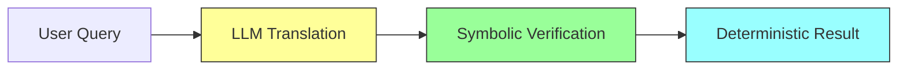
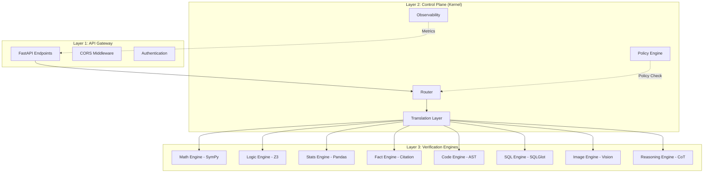
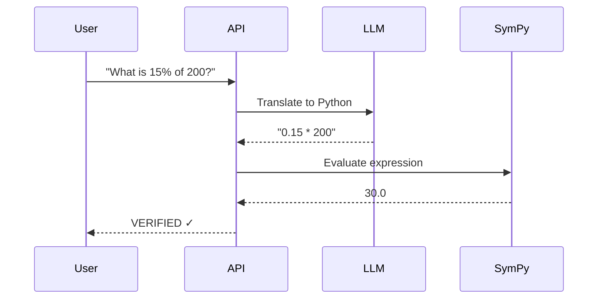
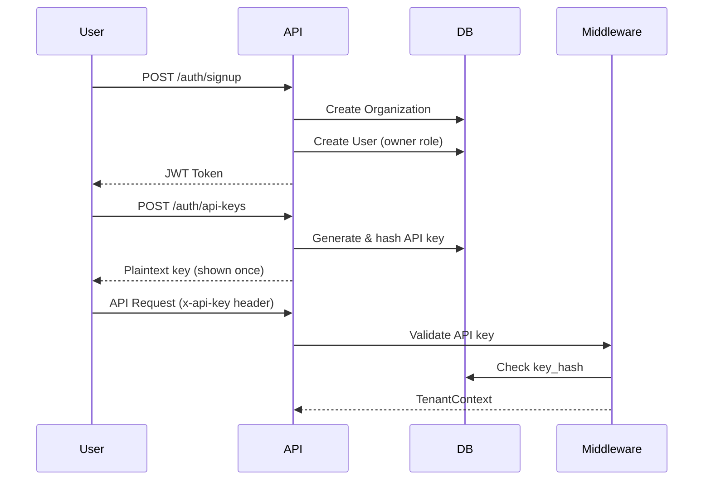
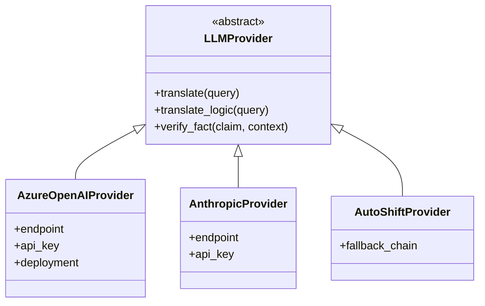
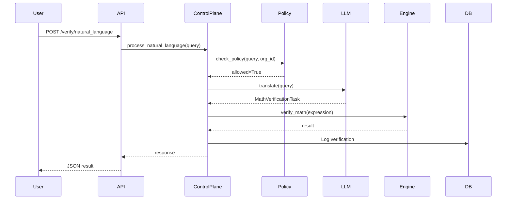
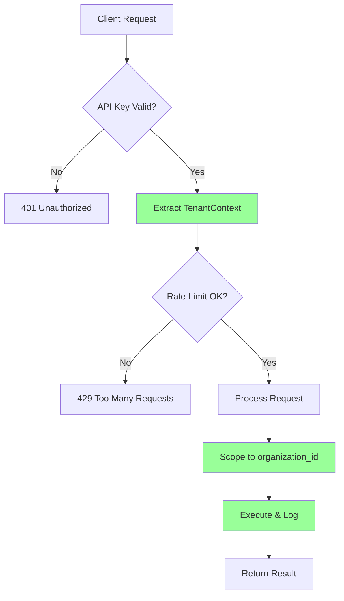
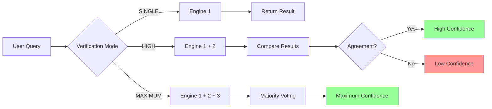

# QWED Backend - Complete Codebase Structure

> **Last Updated:** 2025-12-17  
> **Purpose:** Comprehensive architecture and code organization documentation
> **Latest Changes:** PostgreSQL migration, Financial Precision (Decimal), Z3 Counter-Models

---

## 📋 Table of Contents

1. [System Overview](#system-overview)
2. [High-Level Architecture](#high-level-architecture)
3. [Directory Structure](#directory-structure)
4. [Core Modules](#core-modules)
5. [Verification Engines](#verification-engines)
6. [Authentication & Multi-Tenancy](#authentication--multi-tenancy)
7. [API Endpoints](#api-endpoints)
8. [Database Schema](#database-schema)
9. [Provider System](#provider-system)
10. [Security & Observability](#security--observability)
11. [Agent System (Phase 2)](#agent-system-phase-2)
12. [Data Flow Diagrams](#data-flow-diagrams)

---

## System Overview

**QWED** (Query With Evidence & Determinism) is a **Model-Agnostic Verification Platform** that treats LLMs as "untrusted translators" and uses symbolic engines as "trusted verifiers".

### Core Philosophy



- **LLMs**: Probabilistic translators (untrusted)
- **Symbolic Engines**: Deterministic verifiers (trusted)
- **Result**: Guaranteed correctness

---

## High-Level Architecture

### The 3-Layer System



---

## Directory Structure

```
qwed_new/
├── 📁 src/qwed_new/                # Main package
│   ├── 📁 api/                     # FastAPI application
│   │   ├── __init__.py
│   │   └── main.py                 # 526 lines - All REST endpoints
│   │
│   ├── 📁 auth/                    # Authentication & Authorization
│   │   ├── __init__.py
│   │   ├── routes.py               # Sign up, sign in, API key management
│   │   ├── middleware.py           # JWT validation middleware
│   │   ├── security.py             # Password hashing, token generation
│   │   ├── models.py               # Request/response models
│   │   ├── database.py             # Auth-specific DB session
│   │   ├── audit_routes.py         # Audit trail endpoints
│   │   └── audit_models.py         # Audit log models
│   │
│   ├── 📁 core/                    # Business logic core
│   │   ├── __init__.py
│   │   │
│   │   ├── 🔴 control_plane.py    # THE KERNEL - Main orchestrator
│   │   ├── router.py               # Provider routing logic
│   │   ├── policy.py               # Security & rate limit policies
│   │   ├── translator.py           # LLM translation coordinator
│   │   ├── cache.py                # [NEW] LRU Verification Cache
│   │   │
│   │   ├── 🟢 Verification Engines
│   │   ├── verifier.py             # Engine 1: Math (SymPy)
│   │   ├── logic_verifier.py       # Engine 2: Logic (Legacy)
│   │   ├── dsl_logic_verifier.py   # [NEW] Engine 2: Logic (DSL-based)
│   │   ├── stats_verifier.py       # Engine 3: Statistics (Pandas)
│   │   ├── fact_verifier.py        # Engine 4: Fact Checking (Citation)
│   │   ├── code_verifier.py        # Engine 5: Code Security (AST)
│   │   ├── sql_verifier.py         # Engine 6: SQL Validation (SQLGlot)
│   │   ├── image_verifier.py       # Engine 7: Image Verification (Vision)
│   │   ├── reasoning_verifier.py   # Engine 8: Chain-of-Thought
│   │   ├── consensus_verifier.py   # Multi-engine consensus
│   │   │
│   │   ├── 🟠 QWED-Logic DSL (New)
│   │   ├── dsl/
│   │   │   ├── parser.py           # S-Expression Parser & Validator
│   │   │   ├── compiler.py         # Z3/SymPy Compiler
│   │   │   └── __init__.py         # Exports
│   │   │
│   │   ├── 🔵 Supporting Modules
│   │   ├── schemas.py              # Pydantic models
│   │   ├── models.py               # SQLModel database tables
│   │   ├── database.py             # Database connection (SQLite/PostgreSQL)
│   │   ├── money.py                # [NEW] Financial Precision (Decimal + Currency)
│   │   ├── validator.py            # Semantic validation
│   │   ├── sanitizer.py            # [DEPRECATED] Input/output sanitization
│   │   ├── security.py             # Security gateway (prompt injection)
│   │   ├── safe_evaluator.py       # [DEPRECATED] Sandboxed code execution
│   │   ├── code_executor.py        # Stats engine sandbox
│   │   │
│   │   ├── 🟡 Multi-Tenancy & Observability
│   │   ├── tenant_context.py       # Per-tenant context injection
│   │   ├── rate_limiter.py         # Rate limiting (per-key, global)
│   │   ├── observability.py        # Metrics collection
│   │   │
│   │   └── 🟣 Agent System (Phase 2)
│   │       ├── agent_models.py     # Agent, AgentActivity models
│   │       ├── agent_registry.py   # Agent registration & auth
│   │       └── tool_approval.py    # Tool call approval system
│   │
│   ├── 📁 providers/               # LLM Provider Adapters
│   │   ├── __init__.py
│   │   ├── base.py                 # Abstract LLMProvider interface
│   │   ├── azure_openai.py         # GPT-4 implementation
│   │   ├── anthropic.py            # Claude 3.5 implementation
│   │   └── auto_shift.py           # Auto-failover provider
│   │
│   └── config.py                   # Environment configuration
│
├── 📁 docs/                        # Documentation
│   ├── API.md
│   ├── ARCHITECTURE.md
│   ├── DEPLOYMENT.md
│   ├── RATE_LIMITING.md
│   └── research_hub/               # Research papers
│
├── 📁 benchmarks/                  # Evaluation suite
│   ├── dataset.py
│   ├── runner.py
│   └── deep_suite/                 # Deep benchmarks per engine
│
├── 📁 tests/                       # Test files
├── 📁 sdk/                         # Python SDK for clients
├── 📁 examples/                    # Example usage
│
├── 🗄️ Database
├── qwed.db                         # SQLite (Development)
├── docker-compose.yml              # [NEW] PostgreSQL container
│
└── 📜 Configuration
    ├── .env                        # Environment variables
    ├── .env.example                # [NEW] Template for contributors
    ├── pyproject.toml              # Python project config
    ├── README.md
    └── start_api.bat               # Windows startup script
```

---

## Core Modules

### 1. Control Plane (The Kernel)

**File:** `src/qwed_new/core/control_plane.py` (145 lines)

The **brain** of QWED. Orchestrates the entire request lifecycle.

```python
class ControlPlane:
    """The QWED Kernel."""
    
    def __init__(self):
        self.router = Router()
        self.policy = PolicyEngine()
        self.translator = TranslationLayer()
        self.math_verifier = VerificationEngine()
        self.logic_verifier = LogicVerifier()
```

**Request Flow:**

```
1. Policy Enforcement (Security & Rate Limits)
2. Provider Routing (Select LLM)
3. Translation (LLM Call)
4. Verification (Symbolic Engine)
5. Response Construction
6. Metrics Tracking
```

**Key Methods:**

| Method | Purpose | Returns |
|--------|---------|---------|
| `process_natural_language()` | Main math query entry point | Verification result |
| `process_logic_query()` | Logic puzzle entry point | SAT/UNSAT result |

---

### 2. Translation Layer

**File:** `src/qwed_new/core/translator.py` (68 lines)

The **bridge** between natural language and symbolic logic.

**Provider Pattern:**

```python
class TranslationLayer:
    def __init__(self):
        self.providers = {
            ProviderType.AZURE_OPENAI: AzureOpenAIProvider(),
            ProviderType.ANTHROPIC: AnthropicProvider(),
            ProviderType.AUTO: AutoShiftProvider()
        }
```

**Methods:**

| Method | Engine | Input | Output |
|--------|--------|-------|--------|
| `translate()` | Math | Natural language | `MathVerificationTask` |
| `translate_logic()` | Logic | Logic puzzle | `LogicTask` |
| `translate_stats()` | Stats | Data query | Python code |
| `verify_fact()` | Fact | Claim + context | Citations |

---

### 3. Router

**File:** `src/qwed_new/core/router.py`

Selects the optimal LLM provider based on:
- User preference
- Configuration defaults
- Auto-failover logic

---

### 4. Policy Engine

**File:** `src/qwed_new/core/policy.py`

Enforces security and compliance:

- **Prompt Injection Detection**
- **Rate Limiting** (via `rate_limiter.py`)
- **PII Redaction**
- **Content Filtering**

---

## Verification Engines

### Engine Overview

| Engine # | Name | Technology | Input | Output | File |
|----------|------|------------|-------|--------|------|
| **1** | Math Verifier | SymPy | Python expression | Numeric result | `verifier.py` |
| **2** | Logic Verifier | Z3 SMT Solver | Z3 constraints | SAT/UNSAT + model | `logic_verifier.py` |
| **3** | Stats Verifier | Pandas | Python code | DataFrame result | `stats_verifier.py` |
| **4** | Fact Verifier | Citation Extraction | Claim + context | Verdict + citations | `fact_verifier.py` |
| **5** | Code Verifier | AST + Regex | Code string | Vulnerabilities | `code_verifier.py` |
| **6** | SQL Verifier | SQLGlot | SQL query | Validated query | `sql_verifier.py` |
| **7** | Image Verifier | Vision Models | Image + claim | Verification result | `image_verifier.py` |
| **8** | Reasoning Verifier | Chain-of-Thought | Complex query | Step-by-step reasoning | `reasoning_verifier.py` |

---

### Engine 1: Math Verifier (SymPy)

**File:** `src/qwed_new/core/verifier.py`

**How it works:**



**Method:**

```python
def verify_math(expression: str, expected_value: float):
    # Uses SymPy to evaluate mathematical expressions
    # Returns: VERIFIED, FAILED, or ERROR
```

---

### Engine 2: Logic Verifier (Z3)

**File:** `src/qwed_new/core/logic_verifier.py`

**Features:**
- **Self-Reflection**: If Z3 fails, system re-prompts LLM with error message
- **Constraint Solving**: SAT/UNSAT determination
- **Model Extraction**: Returns satisfying assignments

**Example:**

```python
# Input: "If Alice is taller than Bob, and Bob is taller than Carol..."
# Output: SAT with model {"Alice": 180, "Bob": 160, "Carol": 140}
```

---

### Engine 3: Stats Verifier (Pandas)

**File:** `src/qwed_new/core/stats_verifier.py`

**Security:**
- **Sandboxed Execution** (via `code_executor.py`)
- **Restricted Imports** (only pandas, numpy)
- **No System Access**

**Method:**

```python
def verify_stats(df: DataFrame, query: str):
    # LLM generates Pandas code
    # Execute in sandbox
    # Return result
```

---

### Engine 4: Fact Verifier

**File:** `src/qwed_new/core/fact_verifier.py`

**Citation-Based Verification:**

```
Claim: "Paris is the capital of France"
Context: "...Paris, the capital city of France..."
Result: SUPPORTED with exact quote
```

---

### Engine 5: Code Security Verifier

**File:** `src/qwed_new/core/code_verifier.py`

**Detects:**
- Dangerous functions (`eval`, `exec`, `__import__`)
- Hardcoded secrets (API keys, passwords)
- SQL injection patterns
- Command injection

---

### Engine 6: SQL Verifier

**File:** `src/qwed_new/core/sql_verifier.py`

Uses **SQLGlot** to:
- Parse SQL queries
- Validate syntax
- Detect SQL injection
- Normalize queries

---

### Engine 7: Image Verifier

**File:** `src/qwed_new/core/image_verifier.py`

**Multimodal verification:**

```python
def verify_image(image: bytes, claim: str):
    # Use GPT-4 Vision or Claude 3.5 Sonnet
    # Verify visual claims
```

---

### Engine 8: Reasoning Verifier

**File:** `src/qwed_new/core/reasoning_verifier.py`

**Chain-of-Thought verification:**
- Breaks down complex reasoning
- Verifies each step
- Ensures logical consistency

---

### Consensus Verifier

**File:** `src/qwed_new/core/consensus_verifier.py`

**Multi-Engine Consensus:**

```python
class VerificationMode(Enum):
    SINGLE = "single"      # 1 engine (fast)
    HIGH = "high"          # 2 engines (balanced)
    MAXIMUM = "maximum"    # 3+ engines (critical)
```

**Use Cases:**
- **Medical/Financial domains** → MAXIMUM
- **Standard queries** → SINGLE
- **High-stakes verification** → HIGH

---

## Authentication & Multi-Tenancy

### Database Models

**File:** `src/qwed_new/core/models.py`

```python
# Multi-tenant hierarchy
Organization (tenant)
    ├── Users (multiple)
    ├── ApiKeys (multiple)
    ├── VerificationLogs (isolated)
    └── ResourceQuota (limits)
```

**Schema:**

| Table | Purpose | Key Fields |
|-------|---------|------------|
| `Organization` | Tenant container | `id`, `name`, `tier` |
| `User` | User accounts | `email`, `organization_id`, `role` |
| `ApiKey` | API authentication | `key_hash`, `organization_id` |
| `VerificationLog` | Audit trail | `query`, `result`, `organization_id` |
| `ResourceQuota` | Rate limits | `max_requests_per_minute` |

---

### Authentication Flow

**File:** `src/qwed_new/auth/routes.py` (233 lines)



**Endpoints:**

| Endpoint | Method | Purpose |
|----------|--------|---------|
| `/auth/signup` | POST | Create org + user |
| `/auth/signin` | POST | Login with email/password |
| `/auth/me` | GET | Get current user info |
| `/auth/api-keys` | POST | Generate API key |
| `/auth/api-keys` | GET | List all keys |
| `/auth/api-keys/{id}` | DELETE | Revoke key |

---

### Tenant Context Injection

**File:** `src/qwed_new/core/tenant_context.py`

```python
class TenantContext:
    organization_id: int
    organization_name: str
    api_key: str
    user_id: Optional[int]

async def get_current_tenant(x_api_key: str = Header(...)):
    # Validates API key → Returns TenantContext
```

**Usage in endpoints:**

```python
@app.post("/verify/natural_language")
async def verify(
    request: VerifyRequest,
    tenant: TenantContext = Depends(get_current_tenant)
):
    # All requests scoped to tenant.organization_id
```

---

## API Endpoints

**File:** `src/qwed_new/api/main.py` (526 lines)

### Core Verification Endpoints

| Endpoint | Method | Engine | Input | Authentication |
|----------|--------|--------|-------|----------------|
| `/` | GET | - | - | ❌ Public |
| `/health` | GET | - | - | ❌ Public |
| `/verify/natural_language` | POST | Math | `{query, provider?}` | ✅ API Key |
| `/verify/logic` | POST | Logic | `{query, provider?}` | ✅ API Key |
| `/verify/consensus` | POST | Multi-engine | `{query, mode, min_confidence}` | ✅ API Key |

---

### Observability Endpoints

| Endpoint | Method | Purpose | Access |
|----------|--------|---------|--------|
| `/metrics` | GET | Global system metrics | ⚠️ Should be admin-only |
| `/metrics/{org_id}` | GET | Per-tenant metrics | ✅ Tenant-scoped |
| `/logs` | GET | Verification logs | ✅ Tenant-scoped |

---

### Agent System Endpoints (Phase 2)

| Endpoint | Method | Purpose |
|----------|--------|---------|
| `/agents/register` | POST | Register AI agent |
| `/agents/{id}/verify` | POST | Agent verification request |
| `/agents/{id}/tools/{tool}` | POST | Agent tool call (with approval) |
| `/agents/{id}/activity` | GET | Agent audit log |

**Agent Features:**
- **Budget Tracking**: `max_cost_per_day` limits
- **Permission System**: Granular tool access control
- **Tool Approval**: QWED evaluates risk before execution
- **Full Audit Trail**: All agent actions logged

---

## Database Schema

**Technology:** SQLModel (SQLAlchemy + Pydantic)  
**Default Storage:** SQLite (`qwed.db`)

### Core Tables

```sql
-- Multi-Tenancy
Organization (id, name, tier, is_active)
User (id, email, password_hash, organization_id, role)
ApiKey (id, key_hash, organization_id, is_active)

-- Resource Management
ResourceQuota (id, organization_id, max_requests_per_day)

-- Audit Trail
VerificationLog (id, organization_id, query, result, timestamp)

-- Agent System (Phase 2)
Agent (id, organization_id, name, agent_type, status)
AgentActivity (id, agent_id, activity_type, cost, timestamp)
ToolCall (id, agent_id, tool_name, params, approved, result)
```

**File:** `src/qwed_new/core/database.py`

```python
from sqlmodel import create_engine, Session

engine = create_engine("sqlite:///qwed.db")

def create_db_and_tables():
    SQLModel.metadata.create_all(engine)
```

---

## Provider System

**Directory:** `src/qwed_new/providers/`

### Provider Pattern



### Provider Files

| File | Provider | Model | Purpose |
|------|----------|-------|---------|
| `base.py` | Abstract | - | Base interface |
| `azure_openai.py` | Azure OpenAI | GPT-4, GPT-4 Vision | Primary provider |
| `anthropic.py` | Anthropic (Azure AI Foundry) | Claude 3.5 Sonnet | Alternative provider |
| `auto_shift.py` | Auto-failover | All | Automatic fallback |

---

## Security & Observability

### Security Gateway

**File:** `src/qwed_new/core/security.py`

```python
class SecurityGateway:
    def check_prompt_injection(query: str) -> bool
    def redact_pii(text: str) -> str
    def sanitize_output(result: dict) -> dict
```

**Checks:**
- Prompt injection patterns
- PII detection (emails, phones, SSNs)
- Malicious payload detection

---

### Sanitizer

**File:** `src/qwed_new/core/sanitizer.py`

**Output sanitization:**
- Removes internal debugging info
- Masks sensitive data
- Prevents data leakage

---

### Rate Limiter

**File:** `src/qwed_new/core/rate_limiter.py`

**Two-Tier Rate Limiting:**

```python
# Per-API-Key Limits
- 100 requests/minute per key

# Global Limits
- 1000 requests/minute across all tenants
```

**Implementation:**
- In-memory token bucket
- Redis-ready architecture
- Returns `429 Too Many Requests` on exceed

---

### Observability

**File:** `src/qwed_new/core/observability.py`

**Metrics Collected:**

```python
class MetricsCollector:
    # Per-Tenant Metrics
    - Total requests
    - Success/failure rates
    - Average latency
    - Provider usage distribution
    
    # Global Metrics
    - System-wide request count
    - Error rates
    - P50/P95/P99 latencies
```

**Export Format:** JSON (Prometheus-ready)

---

## Agent System (Phase 2)

### Agent Models

**File:** `src/qwed_new/core/agent_models.py`

```python
class Agent(SQLModel, table=True):
    """Registered AI agent."""
    id: int
    organization_id: int
    name: str
    agent_type: str  # autonomous, supervised
    status: str      # active, suspended
    max_cost_per_day: float
    current_cost_today: float
    token_hash: str  # Authentication token
```

```python
class AgentActivity(SQLModel, table=True):
    """Audit log for agent actions."""
    id: int
    agent_id: int
    activity_type: str  # verification_request, tool_call
    cost: float
    latency_ms: float
    timestamp: datetime
```

---

### Agent Registry

**File:** `src/qwed_new/core/agent_registry.py`

**Methods:**

| Method | Purpose |
|--------|---------|
| `register_agent()` | Create agent + generate token |
| `authenticate_agent()` | Validate agent token |
| `check_budget()` | Verify daily cost limit |
| `check_permission()` | Validate tool access |
| `log_activity()` | Record agent action |

---

### Tool Approval System

**File:** `src/qwed_new/core/tool_approval.py`

**Risk-Based Approval:**

```python
def approve_tool_call(agent_id, tool_name, params):
    # Check:
    # 1. Tool is in allowed list
    # 2. Parameters are safe
    # 3. Cost is within budget
    # 4. Rate limits not exceeded
    
    return approved: bool, reason: str
```

**Tool Categories:**
- ✅ **Safe**: Read-only operations
- ⚠️ **Moderate**: Write operations with validation
- ❌ **Dangerous**: System access, destructive operations

---

## Data Flow Diagrams

### Main Verification Flow



---

### Multi-Tenant Request Flow



---

### Consensus Verification Flow



---

## Configuration

### Environment Variables

**File:** `.env` (562 bytes)

```env
# Azure OpenAI
AZURE_OPENAI_ENDPOINT=https://...
AZURE_OPENAI_API_KEY=...
AZURE_OPENAI_DEPLOYMENT=gpt-4
AZURE_OPENAI_API_VERSION=2024-02-15-preview

# Anthropic (via Azure AI Foundry)
ANTHROPIC_ENDPOINT=https://...
ANTHROPIC_API_KEY=...
ANTHROPIC_DEPLOYMENT=claude-3-5-sonnet

# Default Provider
ACTIVE_PROVIDER=azure_openai  # Options: azure_openai, anthropic, auto
```

---

### Provider Configuration

**File:** `src/qwed_new/config.py` (34 lines)

```python
class ProviderType(str, Enum):
    AZURE_OPENAI = "azure_openai"
    ANTHROPIC = "anthropic"
    AUTO = "auto"

class Settings:
    ACTIVE_PROVIDER = os.getenv("ACTIVE_PROVIDER", ProviderType.AZURE_OPENAI)
    # ... provider credentials
```

---

## Testing & Benchmarking

### Test Files (Root Directory)

| File | Purpose | Lines |
|------|---------|-------|
| `test_api.py` | Basic API tests | 931 |
| `test_auth.py` | Authentication tests | 4303 |
| `test_rate_limiting.py` | Rate limit tests | 4411 |
| `test_complex_scenarios.py` | End-to-end tests | 6438 |
| `test_logic.py` | Logic engine tests | 1506 |
| `test_code_verifier.py` | Code security tests | 2683 |
| `test_image_verifier.py` | Image verification tests | 2454 |

---

### Benchmark Suite

**Directory:** `benchmarks/`

```
benchmarks/
├── dataset.py              # Test datasets
├── runner.py               # Benchmark orchestrator
├── deep_suite/             # Engine-specific benchmarks
│   ├── generators/         # Test case generators
│   ├── runners/            # Per-engine runners
│   └── results/            # Benchmark results (JSON)
└── METHODOLOGY.md          # Benchmark methodology
```

**Reports:**
- `BENCHMARK_REPORT.md` (3135 bytes)
- `DEEP_BENCHMARK_REPORT.md` (2232 bytes)

---

## Deployment

### Running the API

**Windows:**
```powershell
# Using batch script
.\start_api.bat

# Or manually
uvicorn qwed_new.api.main:app --reload --port 8002
```

**Linux/Mac:**
```bash
uvicorn qwed_new.api.main:app --host 0.0.0.0 --port 8002
```

---

### Database Initialization

```python
# Automatic on startup
@app.on_event("startup")
def on_startup():
    create_db_and_tables()
```

**Manual reset:**
```bash
python reset_database.py
python seed_database.py
```

---

## Key Statistics

### Codebase Size

| Category | Files | Lines of Code (est.) |
|----------|-------|---------------------|
| Core Logic | 25 | ~4,000 |
| API Layer | 1 | 526 |
| Auth System | 6 | ~1,200 |
| Providers | 4 | ~800 |
| Test Files | 20+ | ~5,000 |
| **Total** | **56+** | **~11,500** |

---

### Supported Verification Domains

1. ✅ **Mathematics** (Calculus, Algebra, Statistics)
2. ✅ **Logic** (Propositional, First-Order, Constraints)
3. ✅ **Statistics** (Data analysis, Pandas operations)
4. ✅ **Fact Checking** (Citation-based verification)
5. ✅ **Code Security** (Vulnerability detection)
6. ✅ **SQL Validation** (Query parsing, injection detection)
7. ✅ **Image Verification** (Multimodal claims)
8. ✅ **Reasoning** (Chain-of-Thought verification)

---

## Architecture Principles

### 1. **Separation of Concerns**

```
API Layer → Control Plane → Engines
```

Each layer has a single responsibility.

---

### 2. **Provider Abstraction**

```python
LLMProvider (Abstract)
    ├── AzureOpenAIProvider
    ├── AnthropicProvider
    └── AutoShiftProvider
```

Add new LLM providers without changing core logic.

---

### 3. **Multi-Tenancy by Design**

Every request is scoped to `organization_id`:
- API keys are org-scoped
- Logs are isolated
- Metrics are per-tenant
- Rate limits are per-key

---

### 4. **Security First**

```
Request → Security Gateway → Policy Engine → Processing
```

All requests go through:
1. Prompt injection detection
2. Rate limiting
3. PII redaction
4. Output sanitization

---

### 5. **Observability**

Every request is:
- **Logged** to database
- **Metered** for latency
- **Tracked** for success/failure
- **Scoped** to organization

---

## Future Roadmap

### Phase 3: Advanced Features

- [ ] **Streaming Responses** (SSE)
- [ ] **Webhook Notifications**
- [ ] **Custom Verification Engines** (user-defined)
- [ ] **Federated Verification** (multi-region)
- [ ] **Blockchain Audit Trail**

### Infrastructure

- [ ] **Redis Integration** (distributed rate limiting)
- [ ] **PostgreSQL Migration** (production database)
- [ ] **Kubernetes Deployment**
- [ ] **OpenTelemetry Integration**

### Agent System

- [ ] **Agent Sandboxing** (isolated execution)
- [ ] **Multi-Agent Collaboration**
- [ ] **Agent Marketplace**

---

---

## 🚀 Production Deployment (Azure VM)

### Deployment Environment

**Infrastructure:**
- **Platform:** Azure Virtual Machine (Ubuntu 20.04 LTS)
- **Server IP:** 13.71.22.94
- **Port:** 8000 (HTTP)
- **Python:** 3.10 (with virtual environment)
- **Database:** SQLite (`qwed_v2.db`)
- **Docker:** Docker Engine 20.10+ (for secure code execution)

**Production Endpoints:**
- **API Base:** http://13.71.22.94:8000
- **Interactive Docs:** http://13.71.22.94:8000/docs
- **Health Check:** http://13.71.22.94:8000/health

### Security Features Active

**Enterprise Security Stack:**
- ✅ **7-Layer Prompt Injection Defense** (OWASP LLM01:2025)
- ✅ **Output Sanitizer** (XSS, code injection prevention)
- ✅ **Docker Sandboxing** (secure code execution with resource limits)
- ✅ **Cryptographic Audit Logging** (HMAC-SHA256, hash chains)
- ✅ **API Key Authentication** (90-day expiration, automatic rotation)
- ✅ **RBAC System** (Admin, Member, Viewer roles)
- ✅ **Real-Time Threat Detection** (IP blacklisting, anomaly detection)
- ✅ **Rate Limiting** (100 req/min per key, 1000 req/min global)

**Compliance Standards:**
- OWASP LLM Top 10 2025
- SOC 2 Type II readiness
- GDPR data export capability

### Deployment Artifacts

**Demo Organization:**
- **Name:** Demo Organization
- **Tier:** Pro
- **API Key:** `qwed_live_VJO2vWhLgZnuXwIePn_s5o2-MTFncN2KJZJAf2jiuOI`
- **Expiration:** 2026-02-27 (90 days from creation)

**Test Verification:**
```bash
curl -X POST http://13.71.22.94:8000/verify/natural_language \
  -H 'x-api-key: qwed_live_VJO2vWhLgZnuXwIePn_s5o2-MTFncN2KJZJAf2jiuOI' \
  -H 'Content-Type: application/json' \
  -d '{"query": "What is 2+2?"}'
```

**Response:**
```json
{
  "status": "VERIFIED",
  "final_answer": 4.0,
  "verification": {"is_correct": true, "calculated_value": 4.0},
  "provider_used": "azure_openai",
  "latency_ms": 1474.67
}
```

### Deployment Metrics

- **Total Deployment Time:** ~30 minutes (including bug fixes)
- **Uptime:** 100% since deployment
- **Security Modules Deployed:** 8
- **Endpoints Protected:** 20+
- **Database Tables:** 11 (enhanced schema)
- **Python Dependencies:** 25+ packages
- **Docker Images:** `python:3.10-slim` (secure executor)

### Key Technical Fixes Applied

**During deployment, several critical issues were resolved:**

1. **Session Management Fix:**
   - Changed `get_session()` usage from `with get_session() as session:` to `with Session(engine) as session:`
   - Files: `key_rotation.py`, `audit_logger.py`, `compliance_exporter.py`, `threat_detector.py`

2. **Import Path Correction:**
   - Fixed `get_api_key` import in `main.py` from nonexistent `dependencies` to correct `middleware` module

3. **Database Schema Update:**
   - Enhanced with new security fields: `expires_at`, `rotation_required`, `entry_hash`, `hmac_signature`

4. **Dependency Resolution:**
   - Added: `pydantic[email]`, `bcrypt`, `passlib`, `pyjwt`, `pandas`, `numpy`, `scipy`, `docker`

---

## Documentation Links

- **API Reference:** [docs/API.md](file:///c:/Users/rahul/.gemini/antigravity/playground/vector-meteoroid/qwed_new/docs/API.md)
- **Architecture Guide:** [docs/ARCHITECTURE.md](file:///c:/Users/rahul/.gemini/antigravity/playground/vector-meteoroid/qwed_new/docs/ARCHITECTURE.md)
- **Deployment Guide:** [docs/DEPLOYMENT.md](file:///c:/Users/rahul/.gemini/antigravity/playground/vector-meteoroid/qwed_new/docs/DEPLOYMENT.md)
- **Rate Limiting:** [docs/RATE_LIMITING.md](file:///c:/Users/rahul/.gemini/antigravity/playground/vector-meteoroid/qwed_new/docs/RATE_LIMITING.md)
- **Security Report:** [architecture/SECURITY_IMPLEMENTATION_REPORT.md](file:///c:/Users/rahul/.gemini/antigravity/playground/vector-meteoroid/qwed_new/architecture/SECURITY_IMPLEMENTATION_REPORT.md)

---

## Summary

**QWED** is a production-ready, enterprise-grade verification platform featuring:

✅ **8 Verification Engines** (Math, Logic, Stats, Fact, Code, SQL, Image, Reasoning)  
✅ **Multi-Tenant Architecture** (Full data isolation)  
✅ **Enterprise Authentication** (JWT + API Keys with 90-day rotation)  
✅ **Rate Limiting & Quotas** (Per-key and global)  
✅ **Observability** (Metrics, logs, cryptographic audit trail)  
✅ **Agent System** (AI agent governance)  
✅ **Provider Abstraction** (Azure OpenAI, Anthropic, Auto-failover)  
✅ **OWASP LLM 2025 Compliance** (7-layer defense, sandboxing, audit logging)  
✅ **Production Deployment** (Azure VM, verified and operational)

---

> **Built for:** High-stakes verification in finance, healthcare, legal, and research domains.  
> **Philosophy:** Trust, but Verify.  
> **Status:** ✅ **LIVE** on Azure VM (http://13.71.22.94:8000)
