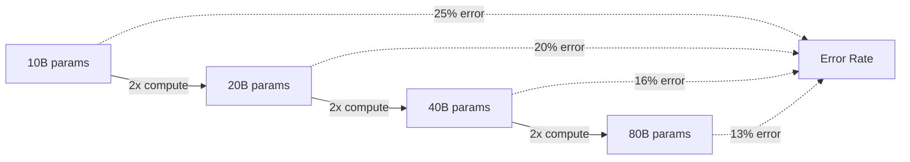
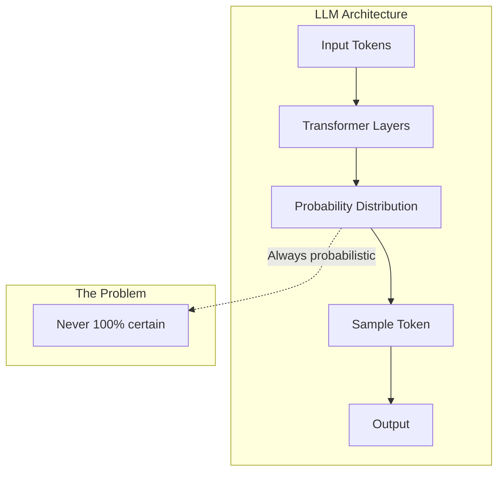
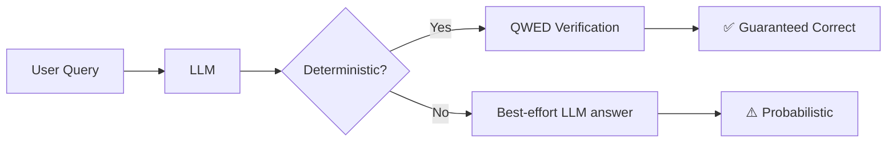
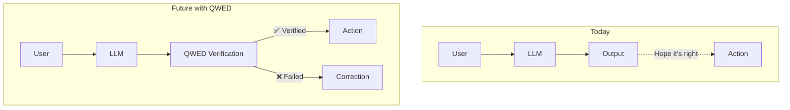

# Why Fine-Tuning Can't Fix AI Hallucinations

The AI industry's response to hallucinations has been: train harder, fine-tune more, add RLHF. But this approach has a fundamental flaw — **you can't train probability to be certainty**.

<!-- truncate -->

## The Hallucination Problem

When GPT-4 confidently states that "Einstein was born in 1879 in Ulm, Germany" — that's knowledge retrieval working correctly.

When it states that "2 + 2 = 5" with equal confidence — that's a hallucination.

The problem? **LLMs can't tell the difference**. Both feel equally "right" to the model.

According to [Ji et al. (2023)](https://arxiv.org/abs/2311.05232), hallucination rates in production LLMs range from 3-27% depending on task type:

| Task Type | Hallucination Rate |
|-----------|-------------------|
| Factual QA | 15-27% |
| Summarization | 8-12% |
| Math reasoning | 20-40% |
| Code generation | 15-25% |

These aren't edge cases — they're the norm.

## The Industry's Response: Train Harder

### Approach 1: More Data

"Just train on more data and the model will learn to be accurate."

**Why it fails:** More data improves *average* accuracy but never eliminates hallucinations. [Scaling laws research](https://arxiv.org/abs/2001.08361) shows diminishing returns — doubling parameters only reduces errors by 10-20%.



You'll never reach 0% error, no matter how much you scale.

### Approach 2: Fine-Tuning

"Fine-tune on correct math examples."

**Why it fails:** Fine-tuning adjusts probability distributions. It makes correct answers *more likely*, not *guaranteed*.

```python
# What fine-tuning does internally
P("2+2=4") = 0.7 → 0.95  # Improved!
P("2+2=5") = 0.2 → 0.04  # Reduced!
P("2+2=3") = 0.1 → 0.01  # Reduced!

# But still not 100%!
```

With millions of inferences, that 4% error rate becomes thousands of wrong answers.

### Approach 3: RLHF

"Use Reinforcement Learning from Human Feedback to train correctness."

**Why it fails:** RLHF optimizes for *human preference*, not mathematical truth.

> "RLHF models learn to produce answers that *look* correct to human raters, not answers that *are* correct."
> — [Bowman (2023)](https://arxiv.org/abs/2310.01405)

Humans rate "The integral of x² is x³/3 + C" as correct because it looks plausible. They can't verify it's mathematically accurate.

### Approach 4: Constitutional AI

"Give the model principles to follow."

**Why it fails:** Principles are expressed in natural language, which LLMs interpret probabilistically. "Don't make things up" is not a hard constraint.

## The Fundamental Problem: Probability ≠ Certainty



LLMs are, at their core, **probability samplers**. They predict the next most likely token given context.

When asked "What is 847 × 923?", the LLM doesn't calculate. It predicts what a correct answer would look like:

```
P("7") = 0.15  # Looks like it could end in 7
P("8") = 0.12  # Could end in 8
P("1") = 0.11  # Could end in 1
...
```

This is fundamentally different from:

```python
result = 847 * 923  # Always returns 781681
```

## The Analogy: Calculators vs. Memory

Imagine teaching a child multiplication tables:

**Memorization approach:**
- 2 × 2 = 4 ✅ (memorized)
- 847 × 923 = ? ❌ (never seen, must guess)

**Calculator approach:**
- Any multiplication = correct ✅ (computed)

LLMs are like extremely good at memorization. But no amount of memorization can cover every possible input.

## QWED's Philosophy: Don't Fix the Liar

Instead of trying to make LLMs more accurate, QWED takes a different approach:

> **Treat LLMs as untrusted translators. Verify their output with deterministic systems.**



### The Key Insight

LLMs are excellent at:
- Understanding natural language
- Translating between formats
- Generating plausible structures

LLMs are terrible at:
- Mathematical precision
- Logical consistency
- Factual accuracy

**Solution:** Use LLMs for what they're good at (translation), and deterministic systems for what requires certainty (verification).

## Practical Example

**User:** "Is this invoice total correct? Subtotal: $100, Tax (18%): $18, Total: $120"

**LLM alone:**
```
"The total appears incorrect. 100 + 18 = 118, not 120."
```
*But the LLM might also say "Yes, that's correct" sometimes.*

**QWED approach:**
```python
# LLM translates to symbolic form
constraint = "(EQ (PLUS 100 18) 120)"

# Z3 solver verifies deterministically
from z3 import *
s = Solver()
s.add(100 + 18 == 120)  # Evaluates to: 118 == 120, FALSE

result = s.check()  # UNSAT - constraint is false
```

**Result:** Mathematical proof that the total is wrong. Not a guess.

## What QWED Provides

| Approach | Guarantee | Latency |
|----------|-----------|---------|
| Fine-Tuned LLM | 95-99% likely correct | 50ms |
| LLM + QWED | 100% verified correct* | 100ms |

*For domains with deterministic verifiers (math, logic, code security).

## When to Use Each Approach

### Use LLMs alone for:
- Creative writing
- Summarization
- Translation
- Conversational AI

### Use QWED verification for:
- Financial calculations
- Medical dosage checking
- Legal compliance
- Scientific computations
- Security-critical code

## The Future: Verified AI

We believe the future of AI is not better LLMs — it's **AI + Verification**.



Training will continue to improve LLMs. But for critical applications, verification is not optional — it's essential.

---

## Conclusion

Fine-tuning, RLHF, and scaling cannot eliminate hallucinations because:

1. **Probability ≠ Certainty** — LLMs sample from distributions
2. **Training ≠ Computing** — Memorization can't cover infinite inputs
3. **Preference ≠ Truth** — RLHF optimizes for likability, not accuracy

QWED provides what training cannot: **mathematical guarantees**.

---

## References

1. Ji, Z., et al. (2023). [Survey of Hallucination in Natural Language Generation](https://arxiv.org/abs/2311.05232). ACM Computing Surveys.
2. Kaplan, J., et al. (2020). [Scaling Laws for Neural Language Models](https://arxiv.org/abs/2001.08361). arXiv.
3. Bowman, S. (2023). [Eight Things to Know about LLMs](https://arxiv.org/abs/2310.01405). arXiv.
4. Ouyang, L., et al. (2022). [Training language models to follow instructions](https://arxiv.org/abs/2203.02155). NeurIPS.
5. Mündler, N., et al. (2023). [Self-contradictory Hallucinations of LLMs](https://arxiv.org/abs/2305.14552). arXiv.

---

**Next up:** [The $1 Trillion Risk of Unverified AI →](/blog/trillion-dollar-risk-unverified-ai)
