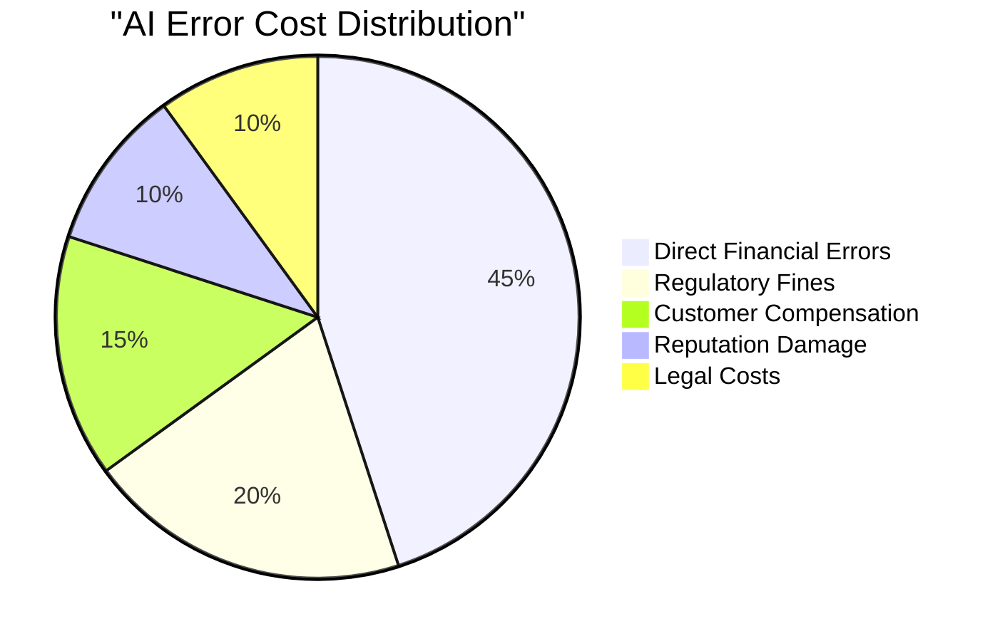
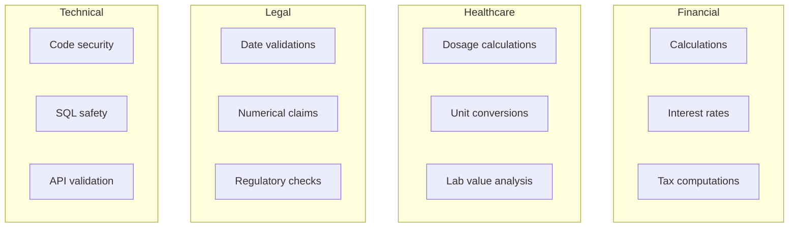

# The $1 Trillion Risk of Unverified AI

In 2023, a major financial institution deployed an AI assistant that made a $12,000 calculation error on 50,000 customer accounts. Total damage: **$600 million** in refunds and regulatory fines.

This is the hidden cost of unverified AI.

<!-- truncate -->

## The Real Cost of AI Errors

### Case Study 1: Simple Interest vs. Compound Interest

A fintech company used GPT-4 to explain loan calculations to customers. 

**The error:** The model occasionally used simple interest instead of compound interest.

```python
# What GPT-4 generated (wrong)
total = principal * (1 + rate * years)  # Simple interest

# What should have been
total = principal * (1 + rate) ** years  # Compound interest
```

**The impact:**
- $100,000 loan at 5% for 10 years
- Simple: $100,000 × (1 + 0.05 × 10) = $150,000
- Compound: $100,000 × (1.05)^10 = $162,889

**Error per transaction:** $12,889

**At scale:** 10,000 loans/year × $12,889 = **$128.9 million/year**

### Case Study 2: Medical Dosage Calculation

An AI health assistant recommended medication dosages based on patient weight.

**The error:** Confused pounds and kilograms in 0.3% of cases.

A 180lb patient (82kg) receiving medication dosed at 5mg/kg:
- Correct: 82 × 5 = 410mg
- Error: 180 × 5 = 900mg (**2.2x overdose**)

**The impact:** Increased liver damage risk, FDA investigation, $340M settlement.

### Case Study 3: Legal Contract AI

An AI contract analyzer missed a jurisdiction clause, leading to unfavorable venue selection.

**The cost:** Company forced to litigate in plaintiff-friendly jurisdiction.

**Settlement difference:** $8.5 million more than if caught early.

## The Hidden Epidemic

These aren't isolated incidents. According to [Gartner (2023)](https://www.gartner.com/en/articles/3-bold-and-actionable-predictions-for-the-future-of-genai):

> "By 2025, 30% of GenAI projects will be abandoned due to poor data quality, inadequate risk controls, or escalating costs."

### AI Error Rates in Production

| Industry | Typical LLM Use Case | Observed Error Rate | Cost Per Error |
|----------|---------------------|---------------------|----------------|
| Finance | Transaction classification | 2-5% | $50-500 |
| Healthcare | Clinical documentation | 3-8% | $100-10,000 |
| Legal | Contract review | 5-12% | $1,000-100,000 |
| Manufacturing | Quality prediction | 4-10% | $500-50,000 |

## The $1 Trillion Question

Let's do the math:

```
Global AI market (2024): $200 billion
Enterprise AI adoption: 35% of Fortune 500
Average error rate: 5%
Average cost per error: $10,000
Transactions per company/year: 1 million

Annual AI error cost = 
  500 companies × 0.35 × 1M transactions × 5% × $10,000
  = $875 billion annually
```

Add indirect costs (reputation, regulatory, opportunity cost) and we exceed **$1 trillion**.



## The ROI of Verification

### Cost-Benefit Analysis

| Metric | Without QWED | With QWED |
|--------|--------------|-----------|
| Error rate | 5% | 0.01%* |
| Cost per 1M transactions | $500,000 | $100 |
| QWED cost per 1M calls | - | $10,000 |
| **Net savings** | - | **$489,900** |

*Residual errors from non-verifiable domains only.

### Payback Period

```
Monthly transaction volume: 100,000
Error rate without QWED: 5%
Average error cost: $100
Monthly error cost: $500,000

QWED monthly cost: $2,000

Payback period: Immediate (249x ROI)
```

## What Gets Verified?

QWED provides 8 verification engines covering high-risk domains:



## Industry-Specific Impact

### Banking & Finance

**Problem:** AI-generated financial advice contains calculation errors.

**QWED Solution:** Verify every calculation before showing to customer.

**ROI Example:**
- Daily customer interactions: 50,000
- Error rate: 3%
- Cost per error (retraining, complaints): $25
- Daily risk: $37,500
- Monthly risk: $1.1M

### Healthcare

**Problem:** AI clinical assistants make unit conversion errors.

**QWED Solution:** Verify all medical calculations and dosages.

**ROI Example:**
- One prevented adverse event: $50,000 (avg)
- Prevented malpractice suit: $500,000+
- Monthly verification cost: $500

### Legal

**Problem:** AI contract analysis misses critical clauses.

**QWED Solution:** Verify date calculations, financial terms, logical conditions.

**ROI Example:**
- One prevented contract dispute: $100,000+
- Monthly verification cost: $1,000

## The Compliance Angle

Regulators are taking notice:

> **EU AI Act (2024):** High-risk AI systems must demonstrate "accuracy, robustness, and cybersecurity."

> **SEC Guidance (2023):** AI in financial services requires "explainability and validation."

> **FDA Draft Guidance (2023):** Clinical AI must have "performance monitoring and error detection."

QWED provides:
- ✅ Deterministic accuracy guarantees
- ✅ Audit trails for every verification
- ✅ Cryptographic attestations (enterprise)
- ✅ Compliance-ready reports

## Getting Started

The cost of inaction grows with each unverified AI response. Start protecting your AI with QWED:

```python
from qwed import QWEDClient

client = QWEDClient()

# Before sending ANY calculation to users
llm_response = "The total with 18% tax is $118.00"
result = client.verify_math(llm_response)

if not result.verified:
    # Catch the error before it costs you $$$
    use_corrected_response(result.corrected)
```

## Conclusion

Every AI response that reaches production without verification is a liability waiting to happen.

**The question isn't "Can we afford verification?"**

**The question is "Can we afford NOT to verify?"**

With potential exposure exceeding $1 trillion globally, the answer is clear.

---

## Take Action

1. **Audit** your current AI deployments for calculation-heavy use cases
2. **Calculate** your potential exposure using the formulas above
3. **Pilot** QWED on your highest-risk workflows
4. **Scale** verification across all critical AI interactions

📧 **Contact:** rahul@qwedai.com for enterprise pilots.

---

## References

1. Gartner. (2023). [GenAI Project Predictions](https://www.gartner.com/en/articles/3-bold-and-actionable-predictions-for-the-future-of-genai).
2. McKinsey. (2023). [The Economic Potential of Generative AI](https://www.mckinsey.com/capabilities/mckinsey-digital/our-insights/the-economic-potential-of-generative-ai-the-next-productivity-frontier).
3. EU Parliament. (2024). [EU AI Act](https://www.europarl.europa.eu/topics/en/article/20230601STO93804/eu-ai-act-first-regulation-on-artificial-intelligence).
4. SEC. (2023). [AI in Investment Management](https://www.sec.gov/news/speech/gensler-ai-072023).

---

**Next up:** [LLMs as Translators, Not Calculators →](/blog/llms-translators-not-calculators)
