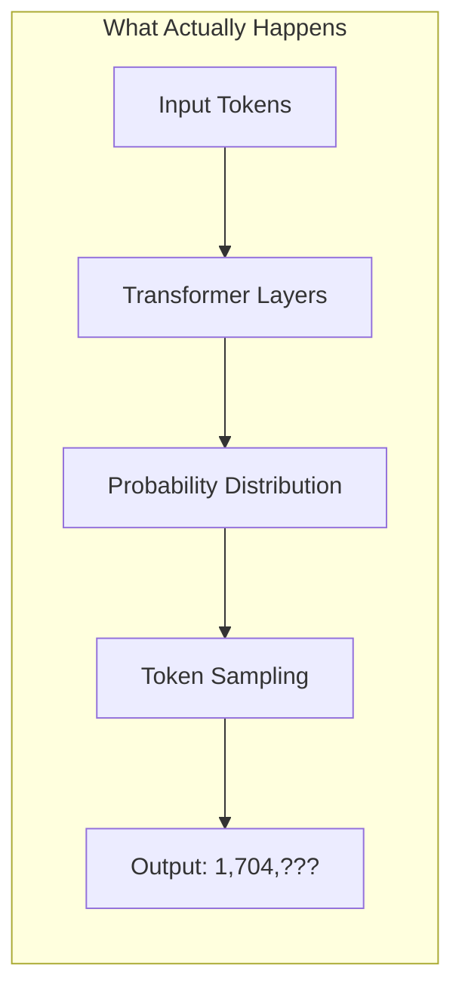
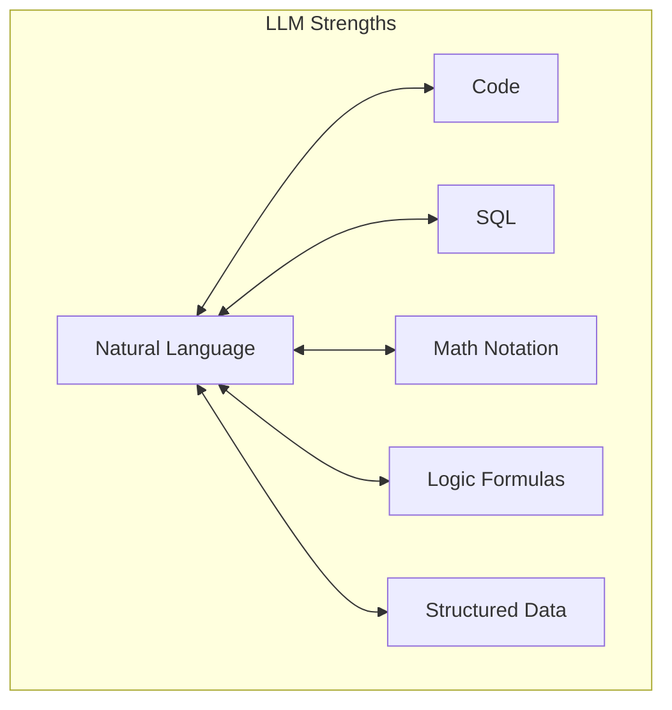
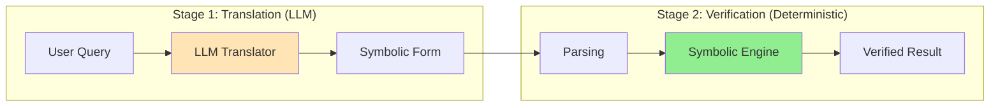
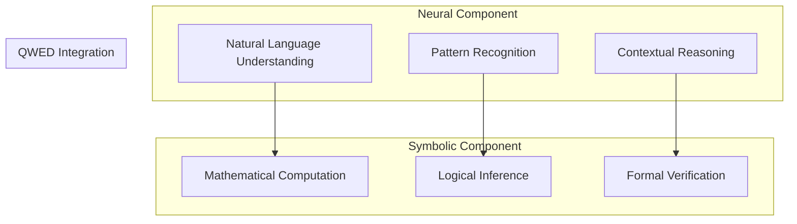
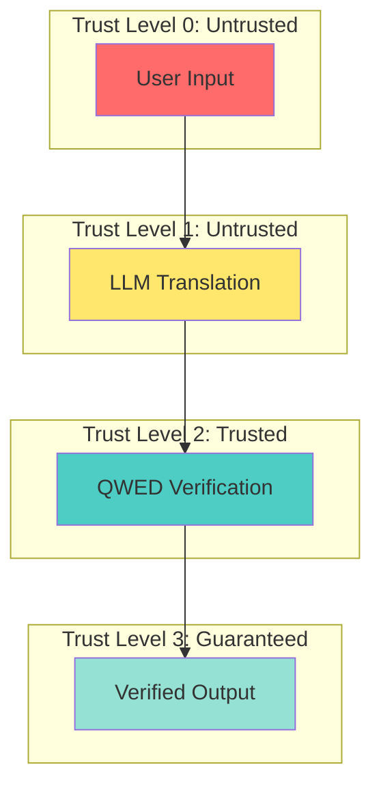

# LLMs as Translators, Not Calculators

QWED is built on a single insight: **LLMs are translators, not calculators**. This reframing changes everything about how we build reliable AI systems.

<!-- truncate -->

## The Prevailing Misconception

When ChatGPT answers "What is 1847 × 923?", users assume it calculates the answer. It doesn't.

```mermaid
graph LR
    subgraph "What Users Think Happens"
        A[Input: 1847 × 923] --> B[Calculation Engine]
        B --> C[Output: 1,704,781]
    end
```





The model predicts what the correct answer **would look like**, character by character. It doesn't compute it.

## The Translation Model

QWED reconceptualizes the LLM's role:

| Traditional View | QWED View |
|------------------|-----------|
| LLM = Universal Computer | LLM = Universal Translator |
| LLM computes answers | LLM translates intent to structure |
| LLM output is final | LLM output is hypothesis |
| Trust the LLM | Verify with deterministic systems |

### What LLMs Are Good At

LLMs excel at **translation between representations**:



**Example translations:**

| From | To | LLM Performance |
|------|-----|-----------------|
| "Add these numbers" | Python: `sum([1,2,3])` | ✅ Excellent |
| "Find customers in NY" | SQL: `WHERE state='NY'` | ✅ Excellent |
| "x squared plus 5" | LaTeX: `x^2 + 5` | ✅ Excellent |
| "If A then B" | Logic: `A → B` | ✅ Excellent |

### What LLMs Are Bad At

LLMs fail at **computing results**:

| Task | LLM Performance |
|------|-----------------|
| 1847 × 923 | ❌ Unreliable |
| `sqrt(2)` to 10 decimals | ❌ Often wrong |
| Validate SQL syntax | ❌ Misses edge cases |
| Check if formula is satisfiable | ❌ Guesses |

## The QWED Architecture

QWED embraces this distinction with a two-stage architecture:



### Stage 1: LLM as Translator

The LLM converts natural language to a verifiable symbolic form:

```python
# User input
query = "Is it true that the sum of angles in a triangle equals 180 degrees?"

# LLM translates to QWED-Logic DSL
symbolic = "(EQ (SUM angle_1 angle_2 angle_3) 180)"
```

The LLM doesn't verify the claim — it just translates it.

### Stage 2: Deterministic Verification

A symbolic engine (SymPy, Z3) verifies the translated form:

```python
from sympy import symbols, Eq, solve

a1, a2, a3 = symbols('a1 a2 a3')
constraint = Eq(a1 + a2 + a3, 180)

# This is deterministic — same input always gives same output
is_consistent = constraint.is_consistent()
```

## The Neuro-Symbolic Paradigm

This architecture aligns with the emerging **neuro-symbolic AI** paradigm:

> "Neuro-symbolic AI combines neural networks (perception, language) with symbolic systems (reasoning, verification) to achieve robust, interpretable intelligence."
> — [Garcez & Lamb (2023)](https://arxiv.org/abs/2305.00813)



### Why Neuro-Symbolic?

| Pure Neural | Pure Symbolic | Neuro-Symbolic (QWED) |
|-------------|---------------|----------------------|
| Flexible but unreliable | Reliable but rigid | Flexible AND reliable |
| Can't guarantee | Can't understand | Understands AND guarantees |
| Scales to language | Doesn't scale | Scales while verifying |

## Practical Implementation

### Example 1: Math Verification

```
User: "Verify that the derivative of x³ is 3x²"

Stage 1 (LLM Translation):
  expression: "diff(x**3, x)"
  claimed_result: "3*x**2"

Stage 2 (SymPy Verification):
  from sympy import diff, symbols
  x = symbols('x')
  actual = diff(x**3, x)  # Returns: 3*x**2
  verified = (actual == 3*x**2)  # True
```

### Example 2: Logic Verification

```
User: "If it's raining, I'll bring an umbrella. It's raining. Will I bring an umbrella?"

Stage 1 (LLM Translation):
  premises: ["(IMPLIES raining umbrella)", "raining"]
  query: "umbrella"

Stage 2 (Z3 Verification):
  from z3 import *
  raining = Bool('raining')
  umbrella = Bool('umbrella')
  s = Solver()
  s.add(Implies(raining, umbrella))
  s.add(raining)
  s.add(umbrella == True)
  result = s.check()  # SAT - verified!
```

### Example 3: SQL Verification

```
User: "Get all users where age > 21"

Stage 1 (LLM Translation):
  sql: "SELECT * FROM users WHERE age > 21"

Stage 2 (SQLGlot Verification):
  from sqlglot import parse
  ast = parse(sql)
  is_read_only = all(stmt.is_select for stmt in ast)
  tables_accessed = ["users"]
  verified = is_read_only and tables_allowed(tables_accessed)
```

## The Trust Hierarchy

QWED establishes clear trust levels:



## Why This Matters

### For Developers

Stop worrying about LLM reliability for deterministic tasks:

```python
# Before QWED
llm_answer = call_llm("What is 847 × 923?")
# Pray it's correct... 🤞

# After QWED
llm_answer = call_llm("What is 847 × 923?")
result = qwed.verify_math(llm_answer)
if result.verified:
    return llm_answer  # ✅ Guaranteed correct
else:
    return result.corrected  # 🔧 Fixed for you
```

### For Enterprises

Build AI systems with auditable guarantees:

- Every verification has a cryptographic attestation
- Audit logs prove what was verified and when
- Compliance teams can demonstrate due diligence

### For Researchers

A framework for combining neural and symbolic AI:

- Formalize the translation interface
- Measure LLM translation accuracy separately from answer accuracy
- Develop better translation training objectives

## Conclusion

The insight that LLMs are translators, not calculators, unlocks a new paradigm for building reliable AI:

1. **LLMs translate** natural language to symbolic forms
2. **Symbolic engines verify** correctness deterministically
3. **Users get guarantees** instead of probabilities

This isn't about making LLMs less useful — it's about using them correctly.

---

## References

1. Marcus, G. (2020). [The Next Decade in AI](https://arxiv.org/abs/2002.06177). arXiv.
2. Garcez, A. & Lamb, L. (2023). [Neurosymbolic AI: The Third Wave](https://arxiv.org/abs/2305.00813). arXiv.
3. Kambhampati, S. (2023). [Can LLMs Really Reason?](https://arxiv.org/abs/2310.03731). arXiv.
4. Nye, M., et al. (2021). [Show Your Work: Scratchpads for Intermediate Computation](https://arxiv.org/abs/2112.00114). arXiv.

---

**Next up:** [Integrating QWED with LangChain →](/blog/qwed-langchain-integration)
