# Integrating QWED with LangChain: A Step-by-Step Guide

[LangChain](https://langchain.com/) is the most popular framework for building LLM applications. In this tutorial, you'll learn how to add QWED verification to your LangChain pipelines.

<!-- truncate -->

## Why Add QWED to LangChain?

LangChain makes it easy to build powerful AI applications:
- 🔗 Chain multiple LLM calls together
- 🛠️ Connect to external tools and databases
- 🤖 Build autonomous agents

But LangChain doesn't verify outputs. A chain can produce hallucinated numbers, unsafe SQL, or vulnerable code.

**QWED adds verification as a first-class citizen.**

```mermaid
flowchart LR
    A[User Query] --> B[LangChain]
    B --> C[LLM Response]
    C --> D[QWED Verification]
    D -->|✅ Verified| E[Return to User]
    D -->|❌ Failed| F[Retry/Correct]
```



## Installation

```bash
pip install langchain qwed
```

## Method 1: Simple Output Verification

The easiest integration — verify outputs before returning them:

```python title="basic_verification.py"
from langchain.chat_models import ChatOpenAI
from langchain.schema import HumanMessage
from qwed import QWEDClient

# Initialize clients
llm = ChatOpenAI(model="gpt-4")
qwed = QWEDClient()

def verified_math_query(question: str) -> str:
    """Ask a math question and verify the answer."""
    
    # Step 1: Get LLM response
    messages = [HumanMessage(content=question)]
    response = llm.invoke(messages)
    llm_answer = response.content
    
    # Step 2: Verify with QWED
    verification = qwed.verify(llm_answer, type="math")
    
    if verification.verified:
        return llm_answer
    else:
        # Return corrected answer
        return f"Corrected: {verification.result.get('correct_answer', llm_answer)}"

# Usage
result = verified_math_query("What is 15% of 847?")
print(result)  # Verified: 127.05
```

## Method 2: Custom LangChain Tool

Create a verification tool that agents can use:

```python title="qwed_tools.py"
from langchain.tools import BaseTool
from pydantic import BaseModel, Field
from qwed import QWEDClient

class MathVerificationInput(BaseModel):
    expression: str = Field(description="Mathematical expression or claim to verify")
    expected: str = Field(description="Expected result to verify against")

class QWEDMathTool(BaseTool):
    name = "verify_math"
    description = """
    Use this tool to verify mathematical calculations.
    Input should be the expression and expected result.
    Returns whether the calculation is correct.
    """
    args_schema = MathVerificationInput
    
    def __init__(self):
        super().__init__()
        self.client = QWEDClient()
    
    def _run(self, expression: str, expected: str) -> str:
        result = self.client.verify_math(
            expression=expression,
            expected_result=expected
        )
        
        if result.verified:
            return f"✅ VERIFIED: {expression} = {expected}"
        else:
            correct = result.result.get('computed_value')
            return f"❌ INCORRECT: {expression} ≠ {expected}. Correct answer: {correct}"
    
    async def _arun(self, expression: str, expected: str) -> str:
        return self._run(expression, expected)


class QWEDSQLTool(BaseTool):
    name = "verify_sql"
    description = """
    Use this tool to verify SQL queries are safe to execute.
    Checks for SQL injection, destructive operations, and schema compliance.
    """
    
    def __init__(self):
        super().__init__()
        self.client = QWEDClient()
    
    def _run(self, query: str, schema: str = None) -> str:
        result = self.client.verify_sql(
            query=query,
            schema=schema,
            dialect="postgresql"
        )
        
        if result.verified:
            return f"✅ SQL is safe to execute: {query}"
        else:
            violations = result.result.get('violations', [])
            return f"🚫 SQL blocked: {violations}"
```

### Using Tools with an Agent

```python title="verified_agent.py"
from langchain.agents import AgentExecutor, create_openai_tools_agent
from langchain.chat_models import ChatOpenAI
from langchain.prompts import ChatPromptTemplate

# Initialize
llm = ChatOpenAI(model="gpt-4")
tools = [QWEDMathTool(), QWEDSQLTool()]

prompt = ChatPromptTemplate.from_messages([
    ("system", """You are a helpful assistant that verifies all calculations.
    ALWAYS use the verify_math tool before presenting mathematical results.
    ALWAYS use the verify_sql tool before suggesting SQL queries."""),
    ("human", "{input}"),
])

agent = create_openai_tools_agent(llm, tools, prompt)
executor = AgentExecutor(agent=agent, tools=tools, verbose=True)

# Run
result = executor.invoke({
    "input": "Calculate compound interest on $10,000 at 5% for 3 years"
})
```

**Output:**
```
> Entering new AgentExecutor chain...
Invoking: verify_math with {'expression': '10000 * (1.05)^3', 'expected': '11576.25'}
✅ VERIFIED: 10000 * (1.05)^3 = 11576.25

The compound interest on $10,000 at 5% for 3 years is $11,576.25.
> Finished chain.
```

## Method 3: LangChain Callbacks

Add verification as a callback that runs automatically:

```python title="qwed_callback.py"
from langchain.callbacks.base import BaseCallbackHandler
from qwed import QWEDClient
import re

class QWEDVerificationCallback(BaseCallbackHandler):
    """Automatically verify LLM outputs containing calculations."""
    
    def __init__(self, verify_patterns: list = None):
        self.client = QWEDClient()
        self.verify_patterns = verify_patterns or [
            r'\d+\s*[+\-*/]\s*\d+\s*=\s*\d+',  # Simple math
            r'\$[\d,]+\.?\d*',  # Currency amounts
            r'\d+%',  # Percentages
        ]
    
    def on_llm_end(self, response, **kwargs):
        """Called when LLM finishes generating."""
        text = response.generations[0][0].text
        
        # Check if response contains verifiable content
        for pattern in self.verify_patterns:
            matches = re.findall(pattern, text)
            if matches:
                for match in matches:
                    result = self.client.verify(match, type="math")
                    if not result.verified:
                        # Log or alert on verification failure
                        print(f"⚠️ VERIFICATION FAILED: {match}")
                        print(f"   Correct: {result.result}")

# Usage
from langchain.chat_models import ChatOpenAI

llm = ChatOpenAI(
    model="gpt-4",
    callbacks=[QWEDVerificationCallback()]
)

response = llm.invoke("What is 15% tip on a $80 bill?")
# Automatically verifies any calculations in the response
```

## Method 4: Chain with Verification Step

Build verification directly into your chain:

```python title="verified_chain.py"
from langchain.chat_models import ChatOpenAI
from langchain.prompts import PromptTemplate
from langchain.schema.runnable import RunnablePassthrough, RunnableLambda
from qwed import QWEDClient

llm = ChatOpenAI(model="gpt-4")
qwed = QWEDClient()

# Prompt for financial calculations
calc_prompt = PromptTemplate(
    template="""Calculate the following and show your work:
    {question}
    
    Provide the final answer as: ANSWER: [number]""",
    input_variables=["question"]
)

def verify_and_correct(response: str) -> str:
    """Verification step in the chain."""
    result = qwed.verify(response, type="math")
    
    if result.verified:
        return f"✅ {response}"
    else:
        correction = result.result.get('correct_answer', 'Unknown')
        return f"⚠️ Corrected: Original said {response}, but correct answer is {correction}"

# Build the chain
chain = (
    {"question": RunnablePassthrough()}
    | calc_prompt
    | llm
    | RunnableLambda(lambda x: x.content)
    | RunnableLambda(verify_and_correct)
)

# Run
result = chain.invoke("What is 847 divided by 23?")
print(result)
# ✅ The calculation 847 ÷ 23 = 36.83 is verified.
```

## Method 5: RAG with Verified Facts

Verify facts in Retrieval-Augmented Generation:

```python title="verified_rag.py"
from langchain.embeddings import OpenAIEmbeddings
from langchain.vectorstores import Chroma
from langchain.chat_models import ChatOpenAI
from langchain.chains import RetrievalQA
from qwed import QWEDClient

# Setup RAG
embeddings = OpenAIEmbeddings()
vectorstore = Chroma(embedding_function=embeddings)
retriever = vectorstore.as_retriever()
llm = ChatOpenAI(model="gpt-4")
qwed = QWEDClient()

def verified_rag_query(question: str) -> dict:
    """RAG with fact verification."""
    
    # Standard RAG
    qa_chain = RetrievalQA.from_chain_type(
        llm=llm,
        retriever=retriever,
        return_source_documents=True
    )
    
    result = qa_chain.invoke({"query": question})
    answer = result["result"]
    sources = result["source_documents"]
    
    # Verify facts against sources
    source_text = " ".join([doc.page_content for doc in sources])
    
    verification = qwed.verify_fact(
        claim=answer,
        context=source_text
    )
    
    return {
        "answer": answer,
        "verified": verification.verified,
        "confidence": verification.result.get("confidence", 0),
        "sources": [doc.metadata for doc in sources]
    }

# Usage
result = verified_rag_query("What was the company's Q3 revenue?")
print(f"Answer: {result['answer']}")
print(f"Verified: {result['verified']}")
print(f"Confidence: {result['confidence']:.0%}")
```

## Complete Example: Financial Advisor Bot

Putting it all together:

```python title="financial_advisor.py"
from langchain.agents import AgentExecutor, create_openai_tools_agent
from langchain.chat_models import ChatOpenAI
from langchain.prompts import ChatPromptTemplate
from langchain.tools import Tool
from qwed import QWEDClient

qwed = QWEDClient()

# Tool definitions
def verify_calculation(input_str: str) -> str:
    """Verify any mathematical calculation."""
    result = qwed.verify(input_str, type="math")
    if result.verified:
        return f"✅ Calculation verified: {input_str}"
    else:
        return f"❌ Error found. Correct answer: {result.result}"

def verify_financial(input_str: str) -> str:
    """Verify financial calculations (compound interest, etc)."""
    result = qwed.verify(input_str, type="math")
    return f"Financial verification: {result.status}"

tools = [
    Tool(
        name="verify_calculation",
        func=verify_calculation,
        description="Verify mathematical calculations. Always use before presenting numbers."
    ),
    Tool(
        name="verify_financial",
        func=verify_financial,
        description="Verify financial calculations like interest, ROI, etc."
    )
]

prompt = ChatPromptTemplate.from_messages([
    ("system", """You are a financial advisor assistant.
    You MUST verify ALL calculations using the verify_calculation tool before presenting them.
    Never present unverified numbers to users. Financial accuracy is critical."""),
    ("human", "{input}"),
    ("placeholder", "{agent_scratchpad}"),
])

llm = ChatOpenAI(model="gpt-4", temperature=0)
agent = create_openai_tools_agent(llm, tools, prompt)
executor = AgentExecutor(agent=agent, tools=tools, verbose=True)

# Example query
result = executor.invoke({
    "input": "If I invest $50,000 at 7% annual return for 20 years, how much will I have?"
})

print(result["output"])
```

## Best Practices

### 1. Verify Before Returning

Always verify before showing results to users:

```python
# ✅ Good
answer = llm.invoke(question)
verified = qwed.verify(answer)
return verified.result if verified.verified else "Verification failed"

# ❌ Bad
return llm.invoke(question)  # Unverified!
```

### 2. Use Appropriate Verification Types

```python
# Math calculations
qwed.verify(response, type="math")

# SQL queries
qwed.verify_sql(query, schema=schema)

# Code security
qwed.verify_code(code, language="python")

# Logical claims
qwed.verify_logic(statement)
```

### 3. Handle Verification Failures

```python
result = qwed.verify(answer)

if result.status == "VERIFIED":
    return answer
elif result.status == "CORRECTED":
    return result.corrected
elif result.status == "FAILED":
    return retry_with_feedback(result.explanation)
elif result.status == "BLOCKED":
    log_security_event(result)
    return "Request blocked for security reasons"
```

## Conclusion

Integrating QWED with LangChain adds a crucial verification layer to your AI applications:

- ✅ **Output Verification** — Check all calculations before returning
- ✅ **Tool-Based** — Let agents verify their own work
- ✅ **Callbacks** — Automatic verification without code changes
- ✅ **Chain Integration** — Build verification into pipelines

The result: LangChain applications you can trust.

---

## Resources

- [QWED Documentation](https://docs.qwedai.com)
- [LangChain Docs](https://python.langchain.com/)
- [GitHub: qwed-verification](https://github.com/QWED-AI/qwed-verification)

---

**Next up:** [Building Verified AI Agents with CrewAI →](/blog/qwed-crewai-agents)
