# Building Verified AI Agents with CrewAI

[CrewAI](https://crewai.com/) enables teams of AI agents to collaborate on complex tasks. But autonomous agents making decisions without verification is risky. This tutorial shows how to build **verified AI crews**.

<!-- truncate -->

## The Challenge: Autonomous Agents Run Amok

CrewAI agents can:
- Execute code
- Query databases
- Make API calls
- Generate financial calculations

Without verification, errors compound as agents hand off work to each other:

```mermaid
graph LR
    A[Agent 1] -->|Calculation Error| B[Agent 2]
    B -->|Uses Bad Data| C[Agent 3]
    C -->|Wrong Conclusion| D[Final Report]
    D -->|💀| E[Business Decision]
```



One error in Agent 1 leads to a completely wrong business decision.

## The Solution: QWED-Verified Agents

QWED adds verification gates between agent handoffs:

```mermaid
graph LR
    A[Agent 1] --> V1[QWED ✓]
    V1 -->|Verified| B[Agent 2]
    B --> V2[QWED ✓]
    V2 -->|Verified| C[Agent 3]
    C --> V3[QWED ✓]
    V3 -->|Verified| D[Final Report ✅]
```



## Installation

```bash
pip install crewai qwed
```

## Method 1: Verification Before Handoff

The simplest approach — verify each agent's output:

```python title="verified_crew.py"
from crewai import Agent, Task, Crew
from qwed import QWEDClient

qwed = QWEDClient()

# Define agents
researcher = Agent(
    role='Financial Researcher',
    goal='Find accurate financial data',
    backstory='Expert at financial research',
    verbose=True
)

analyst = Agent(
    role='Financial Analyst',
    goal='Analyze data and calculate metrics',
    backstory='Expert at financial modeling',
    verbose=True
)

# Define tasks with verification
def verified_task(agent: Agent, description: str, verify_type: str = "math"):
    """Create a task with output verification."""
    
    task = Task(
        description=description,
        agent=agent,
        expected_output="Detailed analysis with calculations"
    )
    
    # Wrap execute with verification
    original_execute = task.execute
    
    def verified_execute(*args, **kwargs):
        result = original_execute(*args, **kwargs)
        
        # Verify the output
        verification = qwed.verify(result, type=verify_type)
        
        if verification.verified:
            return result
        else:
            # Return corrected result
            return f"[VERIFIED/CORRECTED] {verification.result}"
    
    task.execute = verified_execute
    return task

# Create verified tasks
research_task = verified_task(
    researcher,
    "Research Q3 revenue for ACME Corp",
    verify_type="fact"
)

analysis_task = verified_task(
    analyst,
    "Calculate year-over-year growth rate",
    verify_type="math"
)

# Create crew
crew = Crew(
    agents=[researcher, analyst],
    tasks=[research_task, analysis_task],
    verbose=True
)

result = crew.kickoff()
```

## Method 2: Custom Verified Tools

Give agents QWED-powered tools:

```python title="qwed_crewai_tools.py"
from crewai_tools import BaseTool
from qwed import QWEDClient
from pydantic import BaseModel, Field

class CalculatorInput(BaseModel):
    expression: str = Field(description="Mathematical expression to calculate")

class VerifiedCalculatorTool(BaseTool):
    name: str = "verified_calculator"
    description: str = """
    A calculator that guarantees correct results.
    Use this for ALL mathematical calculations.
    Returns verified, correct answers.
    """
    args_schema: type[BaseModel] = CalculatorInput
    
    def __init__(self):
        super().__init__()
        self.qwed = QWEDClient()
    
    def _run(self, expression: str) -> str:
        # First attempt: use Python eval (safely)
        try:
            result = eval(expression, {"__builtins__": {}}, {"abs": abs, "round": round})
        except:
            result = "Unable to compute"
        
        # Verify with QWED
        verification = self.qwed.verify_math(
            expression=expression,
            expected_result=str(result)
        )
        
        if verification.verified:
            return f"✅ {expression} = {result} (Verified)"
        else:
            correct = verification.result.get('computed_value', 'Unknown')
            return f"✅ {expression} = {correct} (Corrected from {result})"


class SQLVerifierInput(BaseModel):
    query: str = Field(description="SQL query to verify")
    schema: str = Field(description="Database schema (DDL)", default="")

class VerifiedSQLTool(BaseTool):
    name: str = "verified_sql_generator"
    description: str = """
    Generates and verifies SQL queries.
    Ensures queries are safe (no injection) and valid.
    """
    args_schema: type[BaseModel] = SQLVerifierInput
    
    def __init__(self):
        super().__init__()
        self.qwed = QWEDClient()
    
    def _run(self, query: str, schema: str = "") -> str:
        verification = self.qwed.verify_sql(
            query=query,
            schema=schema,
            dialect="postgresql"
        )
        
        if verification.verified:
            return f"✅ SQL verified and safe:\n{query}"
        else:
            violations = verification.result.get('violations', [])
            return f"🚫 SQL BLOCKED:\nViolations: {violations}"
```

### Using Tools with Agents

```python title="crew_with_tools.py"
from crewai import Agent, Task, Crew

# Create agents with verified tools
financial_analyst = Agent(
    role='Financial Analyst',
    goal='Perform accurate financial analysis',
    backstory='You are a meticulous analyst who always verifies calculations',
    tools=[VerifiedCalculatorTool()],
    verbose=True
)

data_engineer = Agent(
    role='Data Engineer',
    goal='Generate safe, optimized SQL queries',
    backstory='You specialize in data extraction with security in mind',
    tools=[VerifiedSQLTool()],
    verbose=True
)

# Create tasks
analysis_task = Task(
    description="""
    Calculate the following for our investment portfolio:
    1. Total value: $50,000 initial + 12% annual return over 5 years
    2. ROI percentage
    3. Average annual growth
    
    Use the verified_calculator tool for ALL calculations.
    """,
    agent=financial_analyst,
    expected_output="Verified calculations with final values"
)

query_task = Task(
    description="""
    Generate a SQL query to find:
    - All customers with orders over $1000
    - Include customer name, total orders, total spend
    - Group by customer
    
    Use the verified_sql_generator to ensure the query is safe.
    """,
    agent=data_engineer,
    expected_output="Verified SQL query"
)

# Run crew
crew = Crew(
    agents=[financial_analyst, data_engineer],
    tasks=[analysis_task, query_task],
    verbose=True
)

result = crew.kickoff()
print(result)
```

## Method 3: Verification Callback

Add automatic verification to all agent outputs:

```python title="qwed_callback.py"
from crewai.agents.callbacks import AgentCallbackHandler
from qwed import QWEDClient
import re

class QWEDVerificationCallback(AgentCallbackHandler):
    """Automatically verify agent outputs."""
    
    def __init__(self):
        self.qwed = QWEDClient()
        self.verification_log = []
    
    def on_agent_finish(self, output, **kwargs):
        """Called when an agent finishes its task."""
        
        # Check for mathematical content
        math_patterns = re.findall(r'\$?[\d,]+\.?\d*%?', output)
        
        if math_patterns:
            # Verify mathematical claims
            result = self.qwed.verify(output, type="math")
            
            self.verification_log.append({
                'agent': kwargs.get('agent_name', 'Unknown'),
                'output_preview': output[:100],
                'verified': result.verified,
                'status': result.status
            })
            
            if not result.verified:
                print(f"⚠️ VERIFICATION WARNING: Agent output contains unverified calculations")
                print(f"   Status: {result.status}")
        
        return output  # Return original or modified output
    
    def get_report(self):
        """Get verification report for all agent outputs."""
        verified_count = sum(1 for v in self.verification_log if v['verified'])
        total = len(self.verification_log)
        
        return {
            'total_verified': verified_count,
            'total_outputs': total,
            'success_rate': verified_count / total if total > 0 else 1.0,
            'details': self.verification_log
        }

# Usage
callback = QWEDVerificationCallback()

analyst = Agent(
    role='Analyst',
    goal='Analyze data accurately',
    backstory='Expert analyst',
    callbacks=[callback]
)

# After crew completes
report = callback.get_report()
print(f"Verification Success Rate: {report['success_rate']:.0%}")
```

## Complete Example: Investment Analysis Crew

A full crew that analyzes investments with verification at every step:

```python title="investment_crew.py"
from crewai import Agent, Task, Crew, Process
from qwed import QWEDClient

qwed = QWEDClient()

# Define specialized agents
market_researcher = Agent(
    role='Market Researcher',
    goal='Gather accurate market data and trends',
    backstory="""You are an expert at finding reliable market data.
    You always cite sources and verify facts.""",
    tools=[VerifiedCalculatorTool()],
    verbose=True
)

financial_modeler = Agent(
    role='Financial Modeler',
    goal='Build accurate financial models',
    backstory="""You are a meticulous financial modeler.
    You ALWAYS verify calculations using the verified_calculator tool.
    You never present unverified numbers.""",
    tools=[VerifiedCalculatorTool()],
    verbose=True
)

risk_analyst = Agent(
    role='Risk Analyst',
    goal='Identify and quantify investment risks',
    backstory="""You analyze risk with mathematical precision.
    All risk calculations must be verified.""",
    tools=[VerifiedCalculatorTool()],
    verbose=True
)

report_writer = Agent(
    role='Report Writer',
    goal='Compile findings into clear reports',
    backstory="""You create professional investment reports.
    You ensure all numbers in your reports are verified.""",
    verbose=True
)

# Define tasks
research_task = Task(
    description="""
    Research the following for Tesla (TSLA):
    1. Current stock price
    2. P/E ratio
    3. Revenue growth rate (YoY)
    4. Market cap
    
    Verify all numerical data.
    """,
    agent=market_researcher,
    expected_output="Verified market data with sources"
)

modeling_task = Task(
    description="""
    Based on the research data, calculate:
    1. Projected stock price in 1 year (assume 15% growth)
    2. Fair value using DCF (10% discount rate)
    3. Price-to-Sales ratio
    
    Use verified_calculator for ALL calculations.
    Show your work.
    """,
    agent=financial_modeler,
    expected_output="Financial model with verified calculations",
    context=[research_task]
)

risk_task = Task(
    description="""
    Calculate risk metrics:
    1. Value at Risk (VaR) at 95% confidence
    2. Maximum drawdown scenario
    3. Risk-adjusted return (Sharpe ratio)
    
    All calculations MUST be verified.
    """,
    agent=risk_analyst,
    expected_output="Risk analysis with verified metrics",
    context=[research_task, modeling_task]
)

report_task = Task(
    description="""
    Compile a professional investment report including:
    - Executive Summary
    - Market Data (from research)
    - Financial Model (from modeling)
    - Risk Analysis (from risk assessment)
    - Investment Recommendation
    
    Ensure all numbers are consistent across sections.
    """,
    agent=report_writer,
    expected_output="Complete investment report",
    context=[research_task, modeling_task, risk_task]
)

# Create and run the crew
investment_crew = Crew(
    agents=[market_researcher, financial_modeler, risk_analyst, report_writer],
    tasks=[research_task, modeling_task, risk_task, report_task],
    process=Process.sequential,
    verbose=True
)

# Execute
result = investment_crew.kickoff()

# Verify final report
final_verification = qwed.verify(result, type="math")
print(f"\n=== Final Report Verification ===")
print(f"Status: {final_verification.status}")
print(f"All calculations verified: {final_verification.verified}")

print("\n=== Investment Report ===")
print(result)
```

## Best Practices for Verified Crews

### 1. Always Verify Before Handoff

```python
# In task definitions
task = Task(
    description="...",
    agent=agent,
    callback=verify_before_next  # Verify output
)
```

### 2. Use Typed Tools for Critical Operations

```python
# ✅ Good: Verified tool
tools=[VerifiedCalculatorTool()]  

# ❌ Bad: Generic tool
tools=[Tool(func=lambda x: eval(x))]  
```

### 3. Log All Verifications

```python
callback = QWEDVerificationCallback()
# Use callback with all agents
# Review verification report after crew completes
```

### 4. Fail Fast on Critical Errors

```python
if not verification.verified and task.is_critical:
    raise VerificationError(f"Critical task failed verification: {verification}")
```

## Conclusion

CrewAI + QWED enables:

- ✅ **Verified Multi-Agent Workflows** — Every handoff is validated
- ✅ **Safe Tool Usage** — Calculations and SQL are verified
- ✅ **Audit Trails** — Track what was verified and when
- ✅ **Error Prevention** — Catch mistakes before they cascade

Build AI agents you can trust.

---

## Resources

- [QWED Documentation](https://docs.qwedai.com)
- [CrewAI Docs](https://docs.crewai.com/)
- [Example Repository](https://github.com/QWED-AI/qwed-crewai-examples)

---

**Next up:** [Adding QWED to Your CI/CD Pipeline →](/blog/qwed-cicd-integration)
