# Adding QWED to Your CI/CD Pipeline

As AI-generated code becomes more common, CI/CD pipelines need new verification steps. This guide shows how to integrate QWED into your deployment workflow.

<!-- truncate -->

## Why Verify AI Outputs in CI/CD?

Modern development increasingly uses AI for:
- Code generation (GitHub Copilot, Cursor)
- SQL query building
- Configuration generation
- Documentation

**Problem:** AI-generated artifacts can contain errors that slip past traditional tests.

**Solution:** Add QWED verification as a CI/CD step.

```mermaid
flowchart LR
    A[Push Code] --> B[Build]
    B --> C[Unit Tests]
    C --> D[QWED Verification]
    D -->|✅ Pass| E[Deploy]
    D -->|❌ Fail| F[Block Deploy]
```



## GitHub Actions Integration

### Basic Verification Workflow

```yaml title=".github/workflows/verify.yml"
name: QWED Verification

on:
  push:
    branches: [main, develop]
  pull_request:
    branches: [main]

jobs:
  verify:
    runs-on: ubuntu-latest
    steps:
      - uses: actions/checkout@v4
      
      - name: Setup Python
        uses: actions/setup-python@v5
        with:
          python-version: '3.11'
      
      - name: Install QWED
        run: pip install qwed
      
      - name: Verify SQL Migrations
        run: |
          python -c "
          from qwed import QWEDClient
          import glob
          
          client = QWEDClient()
          
          # Find all SQL files
          sql_files = glob.glob('migrations/*.sql')
          
          failed = []
          for sql_file in sql_files:
              with open(sql_file) as f:
                  sql = f.read()
              
              result = client.verify_sql(sql, dialect='postgresql')
              
              if not result.verified:
                  failed.append({
                      'file': sql_file,
                      'violations': result.result.get('violations', [])
                  })
                  print(f'❌ {sql_file}: {result.status}')
              else:
                  print(f'✅ {sql_file}: VERIFIED')
          
          if failed:
              print(f'\\n{len(failed)} files failed verification')
              exit(1)
          "
      
      - name: Verify Python Code Security
        run: |
          python -c "
          from qwed import QWEDClient
          import glob
          
          client = QWEDClient()
          
          # Check AI-generated code files
          py_files = glob.glob('src/generated/*.py')
          
          for py_file in py_files:
              with open(py_file) as f:
                  code = f.read()
              
              result = client.verify_code(code, language='python')
              
              if not result.verified:
                  print(f'⚠️ Security issue in {py_file}')
                  for vuln in result.result.get('vulnerabilities', []):
                      print(f'  - {vuln}')
                  exit(1)
          
          print('✅ All code verified safe')
          "
```

### Advanced: Multi-Engine Verification

```yaml title=".github/workflows/qwed-full.yml"
name: Full QWED Verification Suite

on:
  push:
    branches: [main]
  pull_request:

env:
  QWED_API_KEY: ${{ secrets.QWED_API_KEY }}

jobs:
  sql-verification:
    name: Verify SQL Queries
    runs-on: ubuntu-latest
    steps:
      - uses: actions/checkout@v4
      - uses: actions/setup-python@v5
        with: { python-version: '3.11' }
      - run: pip install qwed
      
      - name: Verify migrations
        run: python scripts/verify_sql.py migrations/
      
      - name: Verify query files
        run: python scripts/verify_sql.py queries/

  code-verification:
    name: Verify Code Security
    runs-on: ubuntu-latest
    steps:
      - uses: actions/checkout@v4
      - uses: actions/setup-python@v5
        with: { python-version: '3.11' }
      - run: pip install qwed
      
      - name: Scan for vulnerabilities
        run: python scripts/verify_code.py src/

  math-verification:
    name: Verify Calculations
    runs-on: ubuntu-latest
    steps:
      - uses: actions/checkout@v4
      - uses: actions/setup-python@v5
        with: { python-version: '3.11' }
      - run: pip install qwed pytest
      
      - name: Verify financial calculations
        run: python scripts/verify_calculations.py
      
      - name: Run calculation tests
        run: pytest tests/calculations/ --qwed-verify

  aggregate-results:
    name: Aggregate Verification
    needs: [sql-verification, code-verification, math-verification]
    runs-on: ubuntu-latest
    steps:
      - name: All verifications passed
        run: echo "✅ All QWED verifications passed!"
```

## Verification Scripts

### SQL Verification Script

```python title="scripts/verify_sql.py"
#!/usr/bin/env python3
"""Verify all SQL files in a directory."""

import sys
import glob
from pathlib import Path
from qwed import QWEDClient

def verify_sql_files(directory: str) -> bool:
    client = QWEDClient()
    
    sql_files = glob.glob(f"{directory}/**/*.sql", recursive=True)
    
    if not sql_files:
        print(f"No SQL files found in {directory}")
        return True
    
    print(f"Verifying {len(sql_files)} SQL files...")
    
    failed = []
    for sql_file in sql_files:
        with open(sql_file) as f:
            sql = f.read()
        
        result = client.verify_sql(sql, dialect="postgresql")
        
        if result.verified:
            print(f"  ✅ {sql_file}")
        else:
            print(f"  ❌ {sql_file}")
            violations = result.result.get('violations', [])
            for v in violations:
                print(f"     - {v['type']}: {v.get('message', '')}")
            failed.append(sql_file)
    
    print()
    if failed:
        print(f"FAILED: {len(failed)}/{len(sql_files)} files")
        return False
    else:
        print(f"PASSED: All {len(sql_files)} files verified")
        return True

if __name__ == "__main__":
    directory = sys.argv[1] if len(sys.argv) > 1 else "."
    success = verify_sql_files(directory)
    sys.exit(0 if success else 1)
```

### Code Verification Script

```python title="scripts/verify_code.py"
#!/usr/bin/env python3
"""Verify Python code for security issues."""

import sys
import glob
from qwed import QWEDClient

SKIP_PATTERNS = ["test_", "conftest", "__pycache__"]

def verify_python_files(directory: str) -> bool:
    client = QWEDClient()
    
    py_files = glob.glob(f"{directory}/**/*.py", recursive=True)
    py_files = [f for f in py_files if not any(p in f for p in SKIP_PATTERNS)]
    
    print(f"Scanning {len(py_files)} Python files for security issues...")
    
    issues = []
    for py_file in py_files:
        with open(py_file) as f:
            code = f.read()
        
        result = client.verify_code(code, language="python")
        
        if not result.verified:
            vulns = result.result.get('vulnerabilities', [])
            issues.append({
                'file': py_file,
                'vulnerabilities': vulns
            })
    
    if issues:
        print("\n⚠️ Security Issues Found:\n")
        for issue in issues:
            print(f"File: {issue['file']}")
            for v in issue['vulnerabilities']:
                severity = v.get('severity', 'unknown')
                line = v.get('line', '?')
                msg = v.get('message', v.get('type', 'Unknown issue'))
                print(f"  [{severity.upper()}] Line {line}: {msg}")
            print()
        return False
    else:
        print("✅ No security issues found")
        return True

if __name__ == "__main__":
    directory = sys.argv[1] if len(sys.argv) > 1 else "src/"
    success = verify_python_files(directory)
    sys.exit(0 if success else 1)
```

### Calculation Verification Script

```python title="scripts/verify_calculations.py"
#!/usr/bin/env python3
"""Verify mathematical calculations in config files."""

import sys
import json
import yaml
from pathlib import Path
from qwed import QWEDClient

def verify_config_calculations():
    client = QWEDClient()
    
    # Check pricing calculations
    with open("config/pricing.yml") as f:
        pricing = yaml.safe_load(f)
    
    issues = []
    
    for tier in pricing.get('tiers', []):
        name = tier['name']
        base = tier['base_price']
        markup = tier['markup_percentage']
        final = tier['final_price']
        
        # Verify calculation
        expected = base * (1 + markup / 100)
        
        result = client.verify_math(
            expression=f"{base} * (1 + {markup}/100)",
            expected_result=str(final)
        )
        
        if not result.verified:
            issues.append({
                'tier': name,
                'expected': expected,
                'actual': final
            })
            print(f"❌ {name}: {base} * (1 + {markup}%) should be {expected:.2f}, not {final}")
        else:
            print(f"✅ {name}: Price calculation verified")
    
    return len(issues) == 0

if __name__ == "__main__":
    success = verify_config_calculations()
    sys.exit(0 if success else 1)
```

## GitLab CI Integration

```yaml title=".gitlab-ci.yml"
stages:
  - test
  - verify
  - deploy

qwed-verification:
  stage: verify
  image: python:3.11
  script:
    - pip install qwed
    - python scripts/verify_sql.py migrations/
    - python scripts/verify_code.py src/
    - python scripts/verify_calculations.py
  rules:
    - if: $CI_PIPELINE_SOURCE == "merge_request_event"
    - if: $CI_COMMIT_BRANCH == $CI_DEFAULT_BRANCH
```

## Pre-commit Hook

Add QWED verification as a pre-commit hook:

```yaml title=".pre-commit-config.yaml"
repos:
  - repo: local
    hooks:
      - id: qwed-sql-verify
        name: QWED SQL Verification
        entry: python scripts/verify_sql.py
        language: python
        files: \.sql$
        additional_dependencies: [qwed]
      
      - id: qwed-code-verify
        name: QWED Code Security
        entry: python scripts/verify_code.py
        language: python
        files: \.py$
        additional_dependencies: [qwed]
```

Install:
```bash
pip install pre-commit
pre-commit install
```

## Pull Request Comments

Post verification results as PR comments:

```yaml title=".github/workflows/pr-verify.yml"
name: PR Verification Report

on:
  pull_request:
    types: [opened, synchronize]

jobs:
  verify-and-comment:
    runs-on: ubuntu-latest
    permissions:
      pull-requests: write
    
    steps:
      - uses: actions/checkout@v4
      - uses: actions/setup-python@v5
        with: { python-version: '3.11' }
      - run: pip install qwed
      
      - name: Run verification
        id: verify
        run: |
          python scripts/full_verification.py > report.md 2>&1 || true
          echo "report<<EOF" >> $GITHUB_OUTPUT
          cat report.md >> $GITHUB_OUTPUT
          echo "EOF" >> $GITHUB_OUTPUT
      
      - name: Comment on PR
        uses: actions/github-script@v7
        with:
          script: |
            github.rest.issues.createComment({
              issue_number: context.issue.number,
              owner: context.repo.owner,
              repo: context.repo.repo,
              body: `## 🛡️ QWED Verification Report\n\n${{ steps.verify.outputs.report }}`
            })
```

## Monitoring & Alerting

Track verification metrics over time:

```python title="scripts/metrics_reporter.py"
"""Send verification metrics to monitoring."""

import json
from qwed import QWEDClient
from datetime import datetime

def report_metrics(results: dict):
    metrics = {
        'timestamp': datetime.utcnow().isoformat(),
        'sql_files_verified': results['sql']['total'],
        'sql_files_passed': results['sql']['passed'],
        'code_files_scanned': results['code']['total'],
        'vulnerabilities_found': results['code']['vulnerabilities'],
        'calculations_verified': results['math']['total'],
        'calculations_passed': results['math']['passed'],
    }
    
    # Send to your metrics system
    # e.g., Prometheus pushgateway, Datadog, New Relic
    print(json.dumps(metrics, indent=2))

# Use in CI workflow
# python scripts/metrics_reporter.py
```

## Best Practices

### 1. Fail Fast on Critical Issues

```yaml
- name: Verify (fail on any issue)
  run: python scripts/verify.py --strict
```

### 2. Allow Warnings in Development

```yaml
- name: Verify (warn only)
  run: python scripts/verify.py --warn-only
  if: github.ref != 'refs/heads/main'
```

### 3. Cache Verification Results

```yaml
- name: Cache QWED results
  uses: actions/cache@v3
  with:
    path: ~/.qwed/cache
    key: qwed-${{ hashFiles('**/*.sql', '**/*.py') }}
```

### 4. Parallel Verification

```yaml
jobs:
  verify:
    strategy:
      matrix:
        engine: [sql, code, math, logic]
    steps:
      - name: Verify ${{ matrix.engine }}
        run: python scripts/verify_${{ matrix.engine }}.py
```

## Conclusion

Adding QWED to your CI/CD pipeline ensures:

- ✅ **SQL Safety** — No injection vulnerabilities in migrations
- ✅ **Code Security** — AI-generated code is scanned
- ✅ **Calculation Accuracy** — Config values are mathematically correct
- ✅ **Automated Enforcement** — Verification on every push

Don't ship AI-generated artifacts without verification.

---

## Resources

- [GitHub Actions Documentation](https://docs.github.com/actions)
- [QWED CLI Reference](https://docs.qwedai.com/cli)
- [Example Repository](https://github.com/QWED-AI/qwed-cicd-example)

---

**Next up:** [Formal Verification of Chain-of-Thought Reasoning →](/blog/formal-verification-cot)
