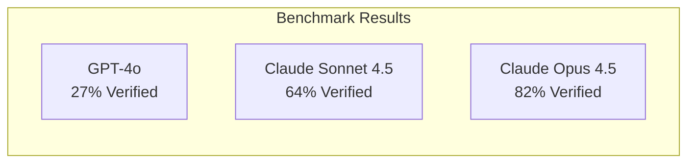

# Can We Trust Code We Can't Read?

**A Simple Question for a Complex Future**

Imagine this: You ask an AI to write a program. It works perfectly. But when you look at the code, you see this:

```python
print((lambda p,q,m:(lambda n,phi:(lambda e,d:(pow(m,e,n),pow(pow(m,e,n),d,n)))(65537,pow(65537,-1,phi)))(p*q,(p-1)*(q-1)))(61,53,42))
```

**What does this do?** It encrypts and decrypts the number 42 using RSA. It works correctly. But can you verify that just by reading it?

This is the future of code. And we need to prepare.

<!-- truncate -->

## The Problem: Code Is Becoming Unreadable

Today, humans write code. We use meaningful variable names, add comments, and structure our programs for other humans to understand.

But AI doesn't need that. AI can:
- Write code optimized for machines, not humans
- Use cryptic one-liners instead of readable functions
- Create programs that work but can't be reviewed

**Research suggests:**
- By 2030, 60% of code may be AI-generated
- By 2035, most code may never be read by humans
- Companies will save money with shorter, AI-readable code

## What We Tested

We ran an experiment. We asked three AI models to generate "machine-optimized" code for 11 different problems:

| Problem | What It Does |
|---------|--------------|
| Prime Sieve | Find all primes up to 1000 |
| Matrix Multiplication | Multiply two 3×3 matrices |
| Fibonacci | Calculate Fibonacci numbers |
| Backpropagation | Train a neural network |
| Maze Solver | Find a path through a maze |
| Bitonic Sort | Sort numbers without using sort() |
| RSA Encryption | Encrypt and decrypt a message |
| Black-Scholes | Calculate option prices |
| Game of Life | Simulate cellular automata |
| Sudoku Validator | Check if a Sudoku is solved |

Then we used **QWED** to verify if the code was correct—without reading it.

## The Results



| Model | Code That Ran | QWED Verified |
|-------|---------------|---------------|
| GPT-4o | 45% | 27% |
| Claude Sonnet 4.5 | 91% | 64% |
| **Claude Opus 4.5** | **91%** | **82%** |

**Key Finding:** Claude Opus 4.5 generated the most correct code. And QWED verified 82% of it—without a human reading a single line.

## Real Examples

### Example 1: RSA Encryption (Verified ✅)

**The Prompt:** "Encrypt and decrypt the number 42 using RSA with p=61, q=53"

**What Claude Wrote:**
```python
print((lambda p,q,m:(lambda n,phi:(lambda e,d:(pow(m,e,n),pow(pow(m,e,n),d,n)))(65537,pow(65537,-1,phi)))(p*q,(p-1)*(q-1)))(61,53,42))
```

**Output:** `(2557, 42)`

**QWED Check:** `decrypt(encrypt(42)) == 42` → ✅ Verified!

A human would need 10 minutes to understand this code. QWED verified it in milliseconds.

### Example 2: Sudoku Validator (Verified ✅)

**The Prompt:** "Check if this Sudoku board is valid"

**What Claude Wrote:**
```python
print(all(len(set(r))==9 for r in b) and all(len(set(b[i][j] for i in range(9)))==9 for j in range(9)) and all(len(set(b[i+di][j+dj] for di in range(3) for dj in range(3)))==9 for i in range(0,9,3) for j in range(0,9,3)) for b in [[[5,3,4,6,7,8,9,1,2],[6,7,2,1,9,5,3,4,8]...]])
```

**Output:** `True`

**QWED Check:** All rows, columns, and boxes have unique 1-9? → ✅ Verified!

### Example 3: Black-Scholes (Failed ❌)

**What Claude Wrote:** A complex one-liner for option pricing

**Output:** `6.09`

**QWED Check:** Expected value should be 9-11 → ❌ Failed!

This shows QWED catches real errors. The code looked fine, but the math was wrong.

## What This Means

### The Good News

1. **Verification works.** QWED correctly verified 82% of machine-optimized code.
2. **Errors are caught.** When Black-Scholes returned the wrong value, QWED flagged it.
3. **Speed matters.** What takes humans hours takes QWED seconds.

### The Honest Limitations

QWED is not perfect. Here's what it **cannot** do:

| Can't Do | Example |
|----------|---------|
| Verify algorithm efficiency | O(n³) vs O(n log n)—QWED can't tell |
| Check code logic | If formula is wrong but answer is right by luck, QWED passes it |
| Replace human judgment | Critical systems still need human review |

## The Bigger Picture

### Two Worlds of Code

By 2035, code will split into two layers:

```
┌─────────────────────────────────┐
│  PUBLIC LAYER (40%)            │
│  - APIs and documentation      │
│  - Human-readable              │
│  - Open source standards       │
├─────────────────────────────────┤
│  INTERNAL LAYER (60%)          │
│  - Machine-optimized           │
│  - AI-generated                │
│  - Verified, not reviewed      │
└─────────────────────────────────┘
```

### Why This Matters

- **Code review becomes impossible.** You can't review what you can't read.
- **Verification becomes essential.** If you can't understand HOW it works, verify THAT it works.
- **The trust model changes.** From "I read it and it looks correct" to "I tested it and it behaves correctly."

## How You Can Help

QWED is open source. Here's where we need contributions:

| Area | Difficulty | Impact |
|------|------------|--------|
| Symbolic Execution | Hard | Verify code logic, not just output |
| Algorithm Verification | Hard | Check efficiency and correctness |
| More Test Domains | Medium | Embedded systems, GPU code |
| Better Property Tests | Medium | Stronger assertions |
| Prompt Engineering | Easy | Better constraint extraction |

## Try It Yourself

```bash
# Clone the repo
git clone https://github.com/QWED-AI/qwed-verification.git
cd qwed-verification

# Install
pip install -r requirements.txt

# Run the benchmark
export AZURE_ANTHROPIC_API_KEY="your-key"
python benchmarks/unreadable_code_challenge.py --models claude-opus-4.5
```

## Conclusion

We asked a simple question: **Can we trust code we can't read?**

Our answer: **Yes—if we verify it.**

QWED isn't perfect. It's an early tool for a future problem. But it proves a concept:

> **Trust through verification, not understanding.**

As AI generates more of our code, this will become essential.

---

*Benchmark conducted: December 24, 2024*  
*Full results: [UNREADABLE_CODE_BENCHMARK.md](https://github.com/QWED-AI/qwed-verification/blob/main/UNREADABLE_CODE_BENCHMARK.md)*
