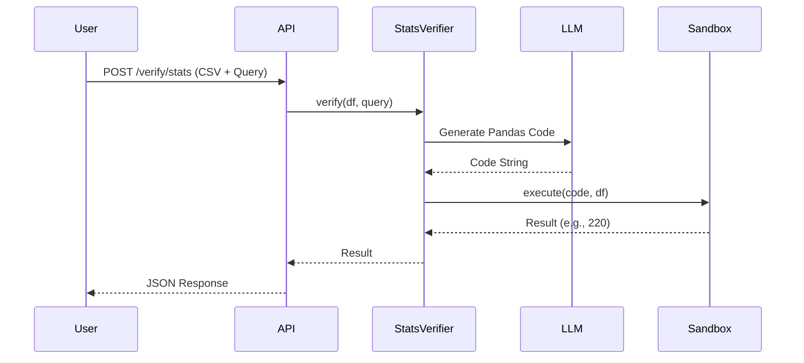

# QWED Architecture Guide

**For Internal Developers & Contributors**

---

## System Overview

QWED is a **Model-Agnostic Verification Engine**. It treats LLMs as "untrusted translators" and uses symbolic engines as "trusted verifiers".

### The 3-Engine Architecture

QWED now supports three distinct verification engines:

1.  **Engine 1: Math Verifier (SymPy)**
    *   **Goal**: Verify mathematical calculations.
    *   **Mechanism**: LLM translates to Python expression -> SymPy evaluates.
    *   **Status**: Production.

2.  **Engine 2: Logic Verifier (Z3)**
    *   **Goal**: Verify logic puzzles and constraint problems.
    *   **Mechanism**: LLM translates to Z3 constraints -> Z3 Solver proves satisfiability.
    *   **Feature**: Includes **Self-Reflection** (if Z3 fails, QWED re-prompts the LLM with the error).

3.  **Engine 3: Statistical Verifier (Pandas)**
    *   **Goal**: Verify claims about tabular data.
    *   **Mechanism**: **Active Interceptor**. QWED generates Pandas code, executes it in a **Secure Sandbox**, and returns the fact.
    *   **Security**: Restricted imports, no system access.

4.  **Engine 4: Fact Verifier (Citation)**
    *   **Goal**: Verify claims against a text context (RAG).
    *   **Mechanism**: **Citation Extraction**. LLM extracts exact quotes to support/refute the claim.
    *   **Output**: Verdict + Exact Citations.

5.  **Engine 5: Code Security Verifier (Static Analysis)**
    *   **Goal**: Detect vulnerabilities in generated code.
    *   **Mechanism**: **AST & Regex**. Scans for dangerous functions (`eval`, `exec`) and secrets.
    *   **Output**: Safe/Unsafe + Issues List.

---

## Directory Structure

```
src/qwed_new/
├── api/                # FastAPI Interface
│   └── main.py         # Endpoints & Middleware
├── core/               # Core Logic
│   ├── schemas.py      # Pydantic Models
│   ├── translator.py   # Orchestrates translation
│   ├── validator.py    # Semantic checks
│   ├── verifier.py     # Engine 1: SymPy
│   ├── logic_verifier.py # Engine 2: Z3
│   ├── stats_verifier.py # Engine 3: Pandas
│   ├── fact_verifier.py  # Engine 4: Citation
│   ├── code_verifier.py  # Engine 5: Static Analysis
│   ├── code_executor.py  # Sandbox for Engine 3
│   ├── security.py     # Security Gateway (Guardrails)
│   └── database.py     # SQLModel Database
├── providers/          # LLM Adapters
│   ├── base.py         # Abstract Base Class
│   ├── azure_openai.py # GPT-4 Implementation
│   └── anthropic.py    # Claude Implementation
└── config.py           # Settings & Env Vars
```

---

## Security Layer

QWED includes a **Security Gateway** (`core/security.py`) that runs before any LLM call:
1.  **Prompt Injection Detection**: Blocks malicious inputs.
2.  **PII Redaction**: Scrubs emails/phones from logs.
3.  **Sandboxing**: Engine 3 runs code in a restricted scope.

---

## Database Layer

QWED persists all verification attempts for auditing and history.

*   **Technology**: [SQLModel](https://sqlmodel.tiangolo.com/) (SQLAlchemy + Pydantic).
*   **Storage**: SQLite (`qwed.db`) by default.
*   **Schema**: `VerificationLog` (`core/models.py`)
    *   `id`: Primary Key
    *   `timestamp`: UTC time
    *   `query`: User input
    *   `result`: JSON result
    *   `is_verified`: Boolean status
    *   `domain`: `MATH`, `LOGIC`, or `STATS`

---

## Data Flow (Engine 3 Example)


