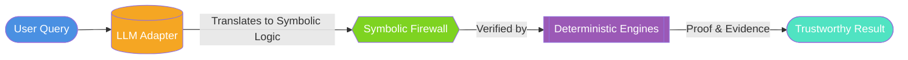
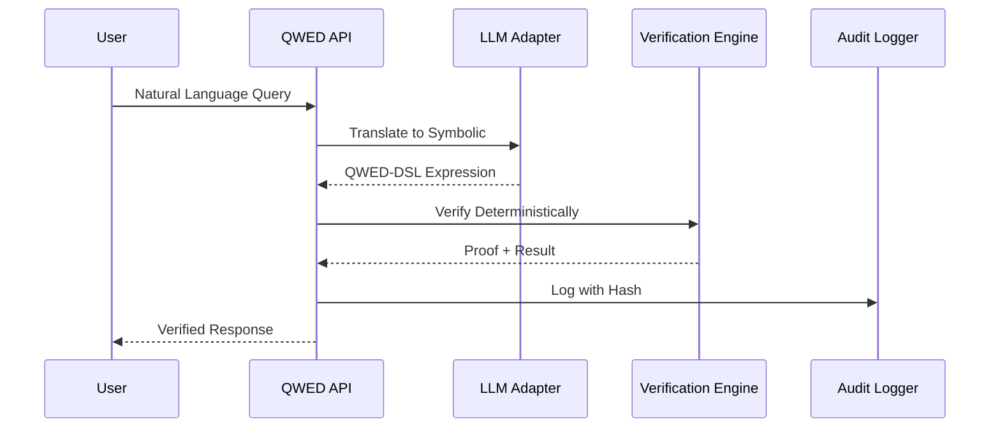

# QWED: The Global Standard for Verifiable AI 🛡️

> **The Future of AI is Not Just Intelligence—It is Trust.**

In a world increasingly driven by probabilistic models, QWED (Query With Evidence & Determinism) serves as the **Critical Verification Layer**. We bridge the gap between AI intuition and mathematical reality.

---

## 🌟 The Vision: A Safe, Auditable AI Future

QWED is more than just a verifier; it is an **Infrastructure for Accountability**. Our mission is to make the most powerful AIs in the world safe for enterprise, compliant for regulators, and trusted by humanity.

### The Problem: The "Hallucination Gap"
LLMs are brilliant translators but unreliable calculators. They can generate perfect-sounding code that deletes your database, or convincing financial reports with subtle math errors.

### The Solution: The Symbolic Firewall
QWED treats LLMs as **Untrusted Translators** and Symbolic Engines as **Trusted Verifiers**.



---

## 🏛️ The 8-Engine Specialized Architecture

We don't rely on one engine for everything. QWED uses **8 Specialized Deterministic Engines**, each a master of its domain.


---

## Engine Deep Dives

### 1. 🏦 Financial Precision (Engine 1)
LLMs use floating-point math. QWED uses **Arbitrary-Precision Decimal Arithmetic**. We verify billions in transactions with zero rounding errors and strict currency awareness.

!!! success "Example"
    ```python
    # LLM says: 0.1 + 0.2 = 0.30000000000000004
    # QWED says: 0.1 + 0.2 = 0.3 ✓
    ```

### 2. 🧠 Formal Logic (Engine 2)
Using the **Microsoft Z3 Theorem Prover**, we prove that business rules are mathematically consistent. If a rule is violated, we don't just say "No"—we provide a **Counter-Model** explaining exactly why.

!!! example "Counter-Model Example"
    > *"Rejected. Violation: `tax_rate` is 12% but 'Electronics' requires 18%."*

### 3. 🛡️ SQL Armor (Engine 6)
We parse AI-generated SQL through an AST (Abstract Syntax Tree) firewall. If the AI suggests `DROP TABLE`, QWED incinerates the request before it even touches your database.

---

## 🔒 Enterprise Safeguards: The Foundation of Trust

QWED is designed for the most regulated industries on Earth.

| Feature | Description |
|---------|-------------|
| **Auditable Proofs** | Every verification result comes with a "Proof of Correctness" |
| **Cryptographic Audit Logs** | Every action is logged with immutable hashes, ready for regulatory audits |
| **Shadow Execution** | Code verification happens in an ephemeral, isolated sandbox |
| **Policy Engine** | Define granular "Golden Rules" that the AI can never cross |

---

## 🛠️ Deep Technical Integration

For developers, QWED is an integrated protocol that fits seamlessly into your stack.

### The Integration Flow



!!! tip "Explore the Specs"
    For deep-dive technical documentation, including file structures and API schemas, check out the [API Reference](api.md).

---

### "Safe AI is the only AI that can change the world."

*Built with ❤️ for a deterministic future.*
