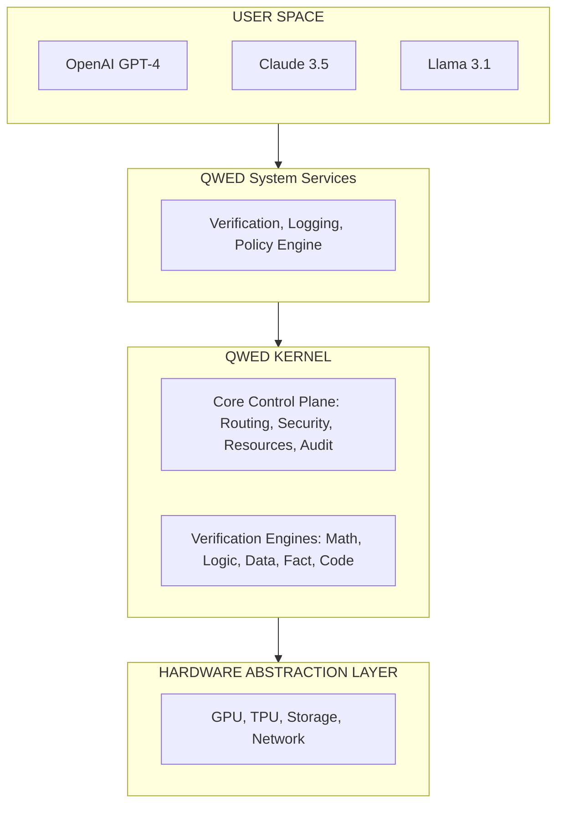

# QWED: The Verification Platform for AI
## A 10-Year Vision Document

### Executive Summary
Just as iOS revolutionized mobile computing and Linux powers modern cloud infrastructure, QWED will become the foundational operating system layer for all AI systems — the universal control plane that every LLM, agent, and AI application runs through.

**The Analogy:**
*   iOS/Android → Operating system for mobile devices
*   Windows/Linux/macOS → Operating system for computers
*   **QWED → Verification Platform for AI systems**

---

### Part 1: Why AI Needs an Operating System
**The Current State: Chaos Without an OS**
Today's AI landscape resembles computing in the 1970s before operating systems standardized:
*   Every AI implementation is custom (like writing assembly for each application)
*   No standard safety layer (like running code without memory protection)
*   No centralized resource management (like manual CPU scheduling)
*   No audit trail (like no logging or accountability)
*   No access control (like multi-user systems without permissions)

**What Users Actually Need**
*   **Safety Guarantees** (like kernel-level memory protection)
*   **Resource Management** (CPU/GPU allocation for AI workloads)
*   **Access Control** (who can use which AI models, for what)
*   **Auditability** (complete logging of all AI interactions)
*   **Data Residency** (ensuring user data never leaves approved boundaries)
*   **Correctness Verification** (like type checking, but for AI outputs)
*   **Standard APIs** (consistent interface across all AI models)

---

### Part 2: QWED as an Operating System

**The OS Architecture Applied to AI**
Drawing from microkernel design and separation kernel principles:

**The 5 Layers of QWED Platform**

1.  **Layer 1: Hardware Abstraction (Infrastructure)**
    *   GPU/TPU resource management
    *   Cloud provider abstraction (AWS, Azure, GCP)

2.  **Layer 2: QWED Kernel (The Core)**
    *   The minimal, trusted computing base.
    *   Symbolic verification engines (Math, Logic, Data, Facts, Code)
    *   Security policy engine
    *   Resource scheduler
    *   Audit logger
    *   Data residency enforcer

3.  **Layer 3: System Services (User Space)**
    *   Verification API
    *   Policy management
    *   Compliance dashboard
    *   Analytics and reporting
    *   Model routing

4.  **Layer 4: AI Model Integration (The Applications)**
    *   All LLMs run through QWED, never directly.
    *   AI models are "untrusted userland processes".

5.  **Layer 5: User Applications**
    *   Enterprise chatbots, Code gen tools, etc.

---

### Part 3: Core OS Design Principles for QWED
1.  **Modularity (Microkernel Philosophy)**: Each verification engine is an isolated module.
2.  **Security (Separation Kernel Model)**: Complete isolation between AI workloads.
3.  **Resource Management**: QWED schedules and allocates CPU/GPU/Memory.
4.  **Abstraction (Hardware Independence)**: Developers interact with QWED APIs, never raw LLMs.
5.  **Auditability (System Logging)**: Every AI interaction is logged.
6.  **Extensibility (Plugin Architecture)**: New engines can be added as plugins.

---

### Part 4: The 10-Year Vision

*   **Phase 1: Foundation (2025-2026) - We Are Here**
    *   Kernel built: 5 verification engines operational
    *   Positioning: "AI Verification Layer"

*   **Phase 2: Platform Evolution (2027-2028)**
    *   Become the middleware: All enterprise AI goes through QWED
    *   Positioning: "Enterprise AI Infrastructure"

*   **Phase 3: OS Emergence (2029-2030)**
    *   QWED SDK, App Store, Resource scheduling
    *   Positioning: "The Verification Platform for AI"

*   **Phase 4: Ecosystem Maturity (2031-2035)**
    *   Mobile integration, Embedded systems, Global standard
    *   Positioning: "The Infrastructure Layer for All AI"

---

### Part 8: Technical Implementation Roadmap

**Near-Term (6 months)**
*   **Kernel Hardening**
    *   Formally verify math engine
    *   Add kernel-level rate limiting
    *   Implement privilege separation
*   **Control Plane API**
    *   Model routing: `qwed.route(prompt, ...)`
    *   Policy engine: Define rules
    *   Observability: Real-time dashboard
*   **Multi-Tenancy**
    *   Isolated namespaces per organization
    *   Per-tenant resource quotas
    *   Cross-tenant data leakage prevention

